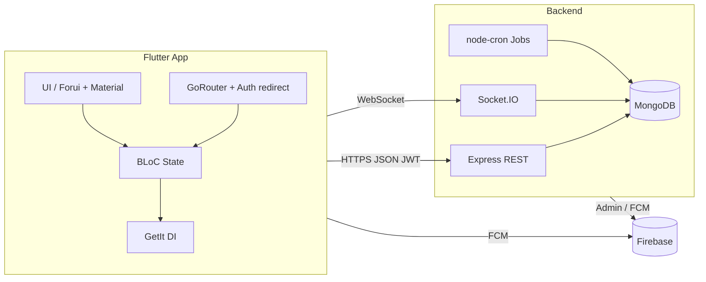

# English for Community (EFC)

**Nền tảng học tiếng Anh full-stack**: ứng dụng **Flutter** cho người học + **Node.js / MongoDB** cho API, thông báo thời gian thực và CMS quản trị. Dự án thể hiện trải nghiệm xây dựng sản phẩm có **auth phân quyền**, **nhiều loại bài học** (nghe, nói, đọc, viết, từ vựng), **tích hợp AI** và **gamification**.

> **For recruiters (EN):** This is a production-style learning app with a Flutter client (BLoC, GoRouter, DI), a REST + WebSocket backend (Express, Mongoose, JWT), Firebase (Auth, FCM, Analytics), offline dictionary (SQLite), and admin content tools. It demonstrates end-to-end ownership from mobile UX to API design and integrations.


---

## Cấu trúc repository

| Thư mục | Vai trò |
|--------|---------|
| [`english_for_community/`](english_for_community/) | Ứng dụng Flutter (iOS, Android, …) |
| [`english_for_community_backend/`](english_for_community_backend/) | API Express + Socket.IO + MongoDB |

---

## Kiến trúc tổng quan



---

## Ứng dụng di động (Flutter)

### Tính năng người dùng

- **Xác thực**: đăng nhập / đăng ký, OTP, quên mật khẩu, đồng bộ trạng thái session; tích hợp **Firebase Auth** và **Google Sign-In**.
- **Home & học tập**: dashboard mục tiêu/ngày, streak, lối tắt tới các kỹ năng, **AI assistant** (dialog), **thông báo** (Socket + local notifications), điều hướng push FCM.
- **Listening**: danh sách bài, phát audio (**just_audio** / **audioplayers**), transcript/cue, bình luận thảo luận.
- **Listening comprehension**: bài dạng comprehension riêng (bloc + API `/api/listening-comp`).
- **Reading**: danh sách + chi tiết bài đọc, làm bài và lưu tiến độ.
- **Speaking**:
  - Bài theo **set/câu**: nhận diện giọng nói (**speech_to_text**), TTS (**flutter_tts**), chấm điểm WER phía client + đồng bộ attempt lên server.
  - **Free speaking**: hội thoại qua **Vapi** (cấu hình assistant lấy qua API backend, không hardcode key trong app).
- **Writing**: chủ đề, làm bài, phản hồi / diff text.
- **Từ vựng**: **SQLite** (`dictionary.db`) tra cứu offline, ôn tập / spaced review, từ cá nhân đồng bộ API.
- **Tiến độ & gamification**: báo cáo, biểu đồ (**fl_chart**), điểm, level, streak (theo dữ liệu user/progress API).
- **Hồ sơ**: chỉnh sửa profile, **lịch sử bài tập**.

### Tính năng quản trị (trong cùng app Flutter)

- Phân quyền **`role == admin`** trong **GoRouter** (redirect khỏi home user, chặn user vào `/admin`).
- Dashboard admin, quản lý user (lọc, ban/unban), **CMS** nội dung: Listening, Reading, Speaking sets, Writing topics, Listening comprehension.
- Quản lý báo cáo (reports), xem lịch sử / hoạt động học viên.

### Stack & patterns (kỹ năng thể hiện trên code)

| Hạng mục | Công nghệ / thực hành |
|----------|------------------------|
| State management | **flutter_bloc**, **equatable** |
| Navigation | **go_router** (redirect theo `UserBloc`, deep links, admin vs user) |
| Dependency injection | **get_it** — đăng ký ApiClient (Dio public/auth), datasource, repository, bloc |
| Networking | **dio**, **pretty_dio_logger**, REST tới backend |
| Local DB | **sqflite** (từ điển), **shared_preferences**, **flutter_secure_storage** |
| Realtime | **socket_io_client** + **SocketLifecycleManager** (connect theo auth, logout cưỡng bức) |
| Push | **firebase_messaging**, **flutter_local_notifications**, **timezone** |
| AI / voice | **google_generative_ai**, **vapi**, **speech_to_text**, **flutter_tts** |
| UI | **Material 3** (`AppTheme`), **forui**, **cached_network_image**, **flutter_svg**, **flutter_markdown** |
| Khác | **permission_handler**, **image_picker** / **file_picker**, **firebase_analytics** |

---

## Backend (Node.js)

### Trách nhiệm chính

- **REST API** (Express) với namespace rõ ràng: `/api/auth`, `/api/users`, `/api/listening`, `/api/listening-comp`, `/api/reading`, `/api/speaking`, `/api/writing`, `/api/vocab`, `/api/progress`, `/api/chat`, `/api/admin`, `/api/reports`, `/api/notifications`.
- **MongoDB** (Mongoose): User, Listening, Reading, Speaking sets/attempts, Writing topics/submissions, vocabulary, progress, notifications, reports, v.v.
- **Socket.IO** trên cùng HTTP server với Express — thông báo realtime, tích hợp middleware xác thực socket.
- **JWT** bảo vệ route; phân quyền admin/user.
- **Cloudinary** (+ multer) cho upload media.
- **Firebase Admin** (FCM / quản trị).
- **node-cron**: ví dụ job thông báo thông minh (`smartNotificationJob`).
- **AI**: tích hợp **OpenAI**, **Google Generative AI**, **Groq**, **@google/genai** — dùng trong chat, chấm writing, ngữ cảnh học tập (xem `services/aiService.js`, `aiContextService.js`, controllers tương ứng).
- **Zod** cho validate / schema ở một số luồng.
- **Nodemailer** gửi email (OTP, reset password, …).

### Scripts

```bash
cd english_for_community_backend
npm install
npm run dev    # nodemon
npm start      # production
npm run seed   # seeder mẫu (user)
```

Cần file **`.env`** (không commit). Tham chiếu biến: `MONGO_URI` hoặc `MONGODB_URI`, `PORT`, JWT, Cloudinary, Firebase, SMTP, và các key AI. File mẫu tối thiểu cho Vapi: [`.env.example`](english_for_community_backend/.env.example) (`VAPI_PUBLIC_KEY`, `VAPI_ASSISTANT_ID` cho Free Speaking).

---

## Chạy ứng dụng Flutter

**Yêu cầu:** Flutter SDK tương thích `sdk: ^3.3.0`, Xcode / Android SDK tùy nền tảng.

```bash
cd english_for_community
flutter pub get
# Cấu hình Firebase: lib/firebase_options.dart + google-services / GoogleService-Info
flutter run
```

- Base URL API và secret **không** nên nằm hardcode trong repo công khai; chỉnh trong lớp cấu hình / env build của bạn.
- **Dictionary**: asset `assets/db/dictionary.db` (SQLite) khai báo trong `pubspec.yaml`.

---

## Bảo mật & thực hành tốt

- Phân tách Dio **có/không** JWT trong `ApiClient`.
- Token an toàn hơn với **flutter_secure_storage**.
- Backend: middleware auth, verify socket; không commit `.env`.
- **Vapi / API keys**: backend cấp config đã xác thực (`/api/speaking/vapi-config`), tránh lộ private key trên client.

---

## Hướng phát triển / mở rộng (gợi ý)

- Test tự động: `flutter_test`, integration; backend: Jest/Supertest cho API quan trọng.
- CI (GitHub Actions): `flutter analyze`, `dart format`, `npm test`.
- Tách environment dev/staging/prod rõ ràng.

---

## Giấy phép & đóng góp

Dự án mang tính portfolio / sản phẩm cá nhân hoặc nhóm. Nếu bạn là nhà tuyển dụng và muốn xem chi tiết module (ví dụ luồng BLoC, contract API), có thể yêu cầu ứng viên demo hoặc walkthrough code.

---

**English for Community** — *Full-stack English learning: Flutter · Node.js · MongoDB · Firebase · Socket.IO · AI-assisted skills practice.*
