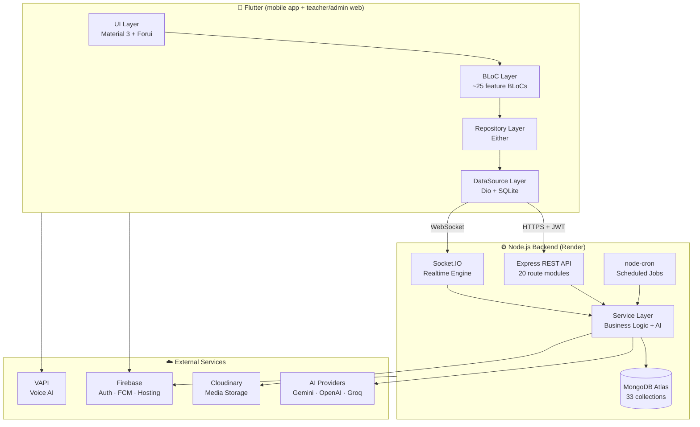

# English for Community (E4C)

> **Full-stack AI-powered English learning platform** — built for real classroom use with **Flutter** (mobile + web), **Node.js** (API), **MongoDB**, **Firebase**, and **Socket.IO** realtime.


---

## What is this?

A **production-grade English learning platform** that goes beyond typical CRUD apps. It connects **teachers**, **students**, and **admins** in a unified ecosystem with:

- **4 core language skills** (Listening, Speaking, Reading, Writing) + Vocabulary
- **Real-time exam sessions** with live proctoring and student screen mirroring
- **AI-powered grading** (Gemini, OpenAI, Groq) for writing & speaking assessment
- **Classroom management** — teachers create classes, assign exams, track progress
- **Gamification** — streaks, XP points, levels, daily goals
- **Bilingual UI** — English & Vietnamese with ARB-based localization

The same Flutter codebase ships **three surfaces**: a **student mobile app** (Android/iOS), and **teacher / admin web consoles** (Flutter Web on Firebase Hosting). The backend is a single Node.js API + Socket.IO server deployed on Render.

---

## Key Highlights

| Area | What it demonstrates |
|------|---------------------|
| **Architecture** | Clean Architecture with BLoC pattern, Repository layer, Either-based error handling |
| **Multi-role system** | 3 distinct user experiences (Student, Teacher, Admin) in one codebase with role-based routing |
| **Realtime** | Socket.IO for live exam sessions, student presence tracking, screen mirroring, classroom chat |
| **AI Integration** | Multi-provider AI (Gemini, OpenAI, Groq) for auto-grading, feedback, and voice AI (VAPI) |
| **Scale** | 33 database models, 20 API route modules, 60+ pages, full CMS for content management |
| **Security** | JWT dual-token (access + refresh), auto-refresh interceptor, RBAC middleware, Helmet, rate limiting, NoSQL-injection sanitizing |
| **Offline** | SQLite dictionary (50k+ words), secure token storage, local notifications |

---

## System Architecture



---

## Features by Role

### Student

| Feature | Description |
|---------|-------------|
| **Skill Practice** | Listening dictation, reading comprehension, writing tasks, speaking (record + AI score) |
| **Exam Taking** | Join live exam sessions via code/link, timed multi-skill integrated exams |
| **Live Session** | Real-time lobby → countdown → exam → auto-submit with integrity tracking |
| **Classroom** | Join teacher's class, view assignments, classroom chat, track personal scores |
| **AI Assistant** | Chat-based learning help powered by Gemini |
| **Vocabulary** | Personal word bank + SRS (Spaced Repetition) review |
| **Free Speaking** | Voice conversation with AI tutor via VAPI |
| **Gamification** | Daily goals, XP, streaks, levels, progress charts |

### Teacher

| Feature | Description |
|---------|-------------|
| **Dashboard** | Overview of classes, upcoming sessions, recent activity |
| **Exam Builder** | Create multi-skill exams (MCQ, fill-blank, essay, listening, reading, grammar) |
| **Integrated Exam Editor** | Build complex exams with multiple skill sections in one exam |
| **Live Exam Console** | Start/pause/end sessions, monitor students in real-time, kick cheaters |
| **Student Live Screen** | Mirror student's exam screen in real-time during proctored sessions |
| **Grading Hub** | Grade essays with AI assistance, manual override, batch operations |
| **Gradebook** | Track all students' scores across assignments with export (Excel) |
| **Classroom Management** | Create classes, invite via code/link, approve members, add co-teachers |
| **Calendar** | Schedule exam sessions, view upcoming deadlines |
| **Assignment Wizard** | Assign exams to classes with due dates, attempts config, scheduling |
| **Analytics** | Performance breakdown per student and per skill |

### Admin

| Feature | Description |
|---------|-------------|
| **CMS** | Full content management for all 5 skills (CRUD + bulk operations) |
| **User Management** | Search, ban/unban, view activity, role assignment |
| **Teacher Applications** | Review & approve teacher role requests |
| **Submission Review** | Moderate student submissions across all skills |
| **Report Moderation** | Handle user reports and flagged content |
| **Release Management** | Push app version updates, force-update flags |
| **Dashboard** | Real-time user stats, content counts, system health |
| **Audit Logs** | Track admin actions for accountability |

---

## Tech Stack

### Frontend — Flutter

| Category | Technology |
|----------|-----------|
| Language | Dart (SDK ≥ 3.3.0) |
| State Management | `flutter_bloc` + `equatable` |
| DI | `get_it` (Service Locator) |
| Routing | `go_router` (role-based redirect, deep links) |
| Networking | `dio` + JWT auto-refresh interceptor |
| Realtime | `socket_io_client` + lifecycle manager |
| Auth | Firebase Auth + Google Sign-In + JWT |
| Local Storage | `flutter_secure_storage` · `shared_preferences` · `sqflite` |
| AI/Voice | `google_generative_ai` · `vapi` · `speech_to_text` · `flutter_tts` |
| Push | Firebase Cloud Messaging + local notifications |
| UI | Material 3 · `forui` · `flutter_animate` · `fl_chart` · `flutter_markdown` |
| i18n | ARB-based (English + Vietnamese) |
| Config | Compile-time `--dart-define` (no per-machine source edits) |

### Backend — Node.js

| Category | Technology |
|----------|-----------|
| Runtime | Node.js ≥ 18 (ES Modules) |
| Framework | Express 4 |
| Hardening | Helmet · Compression (gzip) · CORS · `express-rate-limit` · NoSQL-injection sanitize |
| Database | MongoDB (Mongoose 8) with pagination plugin |
| Auth | JWT dual-token + bcrypt + OTP with TTL |
| Realtime | Socket.IO 4 (rooms, auth middleware, live events) |
| AI | `@google/genai` · `openai` · `groq-sdk` |
| Storage | Cloudinary (multer upload) |
| Validation | Zod 4 |
| Email | Nodemailer (OTP, password reset) |
| Push | Firebase Admin SDK |
| Jobs | node-cron (smart notifications, release scheduler, attempt expiry) |
| Export | ExcelJS (gradebook export) |
| Logging | Morgan |

---

## Realtime Architecture (Socket.IO)

The app uses WebSocket for critical real-time features:

```
┌─────────────────────────────────────────────────────────────────┐
│                     Socket.IO Event System                        │
├─────────────────────────────────────────────────────────────────┤
│                                                                   │
│  👤 User Presence                                                 │
│     user_login / user_logout → online status + admin broadcast    │
│                                                                   │
│  📝 Live Exam Sessions                                            │
│     join_exam_session → lobby → ready check → start → submit      │
│     exam_live_view_sync → student screen mirrored to teacher      │
│     exam_session_state_broadcast → all participants stay in sync  │
│                                                                   │
│  💬 Classroom Chat                                                │
│     join_classroom_chat → realtime messages + read receipts       │
│                                                                   │
│  🎧 Collaborative Learning                                        │
│     join_listening_room → shared cue/comment discussions          │
│                                                                   │
│  📊 Assignment Progress                                           │
│     join_exam_assignment_progress → live grading updates          │
│                                                                   │
│  🔔 Notifications                                                 │
│     Per-user rooms for targeted push delivery                     │
│                                                                   │
└─────────────────────────────────────────────────────────────────┘
```

---

## Database Schema (33 Models)

```
Users & Auth          Learning Content       Exams & Grading         Classroom & Chat
─────────────         ────────────────       ───────────────         ────────────────
User                  Listening              Exam                    Classroom
RolePermission        ListeningComprehension ExamSession             ClassroomMember
TeacherApplication    Reading                ExamAttempt             ClassroomActivityLog
AdminAuditLog         SpeakingSet            ExamAssignment          ClassroomMessage
                      WritingTopics          TeacherAssignmentPreset ClassroomChatReadState
Progress & Social     WritingTopicVersion
────────────────      Word                   Attempts & Submissions
UserDailyProgress     CueComment             ──────────────────────
Enrollment                                   ReadingAttempt · ReadingProgress
Notification                                 WritingSubmission
Report                                       SpeakingAttempt · SpeakingEnrollment
AppRelease                                   DictationAttempt · ListeningCompAttempt
```

---

## API Endpoints (20 Route Modules)

All endpoints are under `/api`. Protected routes require a `Bearer <accessToken>`; admin/teacher routes additionally enforce RBAC middleware.

| Route | Purpose |
|-------|---------|
| `/api/auth` | Register, login, OTP verify, refresh token, password reset |
| `/api/users` | Profile, avatar upload, preferences |
| `/api/teacher` | Teacher dashboard, classrooms, exam CRUD, grading, sessions |
| `/api/exams` | Exam attempts, submissions, live sessions, AI grading |
| `/api/classrooms` | Class CRUD, member management, invites, activity logs |
| `/api/classroom-chat` | Classroom realtime chat (messages, read state) |
| `/api/listening` | Dictation content + cue/comment + attempts |
| `/api/listening-comp` | Listening comprehension exercises (MCQ) |
| `/api/reading` | Reading passages + exercises + attempts |
| `/api/speaking` | Speaking sets, attempts, VAPI config |
| `/api/writing` | Writing topics, submissions, AI feedback |
| `/api/vocab` | Personal word bank, SRS review |
| `/api/progress` | Daily progress, streaks, gamification |
| `/api/chat` | AI assistant conversations (rate-limited) |
| `/api/notifications` | Push notifications, preferences |
| `/api/reports` | User reports, moderation |
| `/api/admin` | Admin dashboard, user management, CMS, audit |
| `/api/admin/app-releases` | App release management |
| `/api/app` | Client version check / force-update |
| `/healthz` | Health check (uptime probe, no auth) |

---

## Repository Structure

```
english_for_community/
├── english_for_community/          # Flutter App (mobile + web)
│   ├── config/                     # dart-define env files
│   │   ├── prod.json               #   committed — production API URL
│   │   └── local.example.json      #   template → copy to local.json (gitignored)
│   ├── lib/
│   │   ├── core/                   # Shared infrastructure
│   │   │   ├── api/                # Dio client, ApiConfig (env-based URL), JWT interceptor
│   │   │   ├── entity/             # Domain entities (Equatable)
│   │   │   ├── datasource/         # Remote & local data access
│   │   │   ├── repository/         # Abstract contracts
│   │   │   ├── repository_impl/    # Concrete implementations
│   │   │   ├── get_it/             # DI container
│   │   │   ├── router/             # GoRouter + auth guard
│   │   │   ├── socket/             # Socket.IO lifecycle
│   │   │   ├── theme/              # Material 3 design system
│   │   │   ├── debug/              # Bloc observer, dev log, global error hooks
│   │   │   └── ui/                 # Shared widgets
│   │   ├── feature/                # Feature modules (auth, home, listening,
│   │   │   │                       #   speaking, reading, writing, vocabulary,
│   │   │   │                       #   student, teacher, admin, progress, profile)
│   │   └── l10n/                   # Localization (EN/VI)
│   └── assets/                     # Fonts, images, SQLite dictionary
│
├── english_for_community_backend/  # Node.js API + Socket.IO
│   ├── src/
│   │   ├── routes/                 # 20 Express route modules
│   │   ├── controllers/            # Request handlers (thin)
│   │   ├── services/               # Business logic + AI
│   │   ├── models/                 # Mongoose schemas (33 models)
│   │   ├── middleware/             # Auth, RBAC, rate limit, sanitize, error handler
│   │   ├── socket/                 # Socket.IO events
│   │   ├── jobs/                   # Scheduled tasks (node-cron)
│   │   ├── lib/                    # JWT, mongo URI, env helpers
│   │   ├── utils/                  # Scoring, mail, progress, ttlCache, tokenHash
│   │   ├── seeds/                  # Demo data seeders
│   │   ├── scripts/               # Maintenance / inspection scripts
│   │   ├── migrations/            # DB migration runner + steps
│   │   └── config/                 # Firebase, Cloudinary
│   ├── app.js                      # Express app (middleware + routes)
│   └── server.js                   # Entry point (DB connect, HTTP + Socket.IO)
│
├── docs/                           # Architecture, optimization plans, UI-UX specs
└── .github/workflows/              # CI/CD (Firebase web deploy, Android APK build)
```

---

## Getting Started

### Prerequisites

- Flutter SDK ≥ 3.3.0
- Node.js ≥ 18
- MongoDB Atlas account (or local MongoDB)
- Firebase project (Auth + FCM + Hosting)

### 1. Backend

```bash
cd english_for_community_backend
npm install
cp .env.example .env     # then fill in real values (see Environment Variables below)
npm run dev              # start with nodemon (auto-reload)
# npm start              # plain node (production-style)
```

The server boots on `http://localhost:3000` (or `PORT`). Verify with `GET /healthz`.

> ℹ️ **Database name:** the backend reads **`MONGO_URI`** (not `MONGODB_URI`) and connects to the **`english_community`** database. The name is pinned in code (`src/lib/mongoUri.js`) and overridable via `MONGO_DB_NAME` — so even if the URI has no `/db` path segment, Mongoose never silently falls back to the `test` database.

### 2. Flutter App

```bash
cd english_for_community
flutter pub get

# Mobile / debug → automatically uses the LOCAL API:
flutter run

# If your LAN IP differs from the default, copy the template and point at your machine:
cp config/local.example.json config/local.json   # edit LOCAL_LAN_IP, then:
flutter run --dart-define-from-file=config/local.json
```

To run/build against the **production** API explicitly:

```bash
flutter run   --dart-define-from-file=config/prod.json
flutter build web    --release --dart-define-from-file=config/prod.json
flutter build apk    --release --dart-define-from-file=config/prod.json
```

### 3. Seed Demo Data

```bash
cd english_for_community_backend
# requires SEED_ADMIN_PASSWORD / SEED_STUDENT_PASSWORD etc. to be set
npm run seed:full-demo   # admin + content + classrooms + student sample data
```

---

## Configuration — API Base URL (local vs. production)

Environment selection lives in **compile-time defines**, not in source — so you never edit `api_config.dart` to switch targets, and machine-specific IPs never leak into commits.

| Build | Resolved API |
|-------|--------------|
| `flutter run` (debug) | **Local** — web `localhost`, Android AVD `10.0.2.2`, LDPlayer / real device → `LOCAL_LAN_IP` |
| `flutter build --release` (CI) | **Production** (Render) |
| Any build with `--dart-define=API_BASE_URL=…` | The URL you pass (highest priority) |

Defines (`lib/core/api/api_config.dart`):

| Define | Default | Meaning |
|--------|---------|---------|
| `API_BASE_URL` | _(empty)_ | Explicit override. Empty → auto by build mode. |
| `LOCAL_LAN_IP` | `192.168.1.72` | LAN IP of your dev machine for physical devices / LDPlayer |
| `LOCAL_PORT` | `3000` | Local backend port |

`config/local.json` is **gitignored**; `config/prod.json` is committed and used by CI.

---

## Deployment & CI/CD

Pushing to **`main`** triggers automated builds. Both clients point at the production API via `config/prod.json`.

### Backend → Render (Web Service)

- Root directory: `english_for_community_backend`, build `npm install`, start `npm start`.
- Set all secrets in the Render **Environment** tab (see table below).
- Render terminates TLS at a proxy → the app sets **`trust proxy`** (`TRUST_PROXY_HOPS`, default `1`) so `express-rate-limit` reads the real client IP. Without it, rate-limited routes (e.g. login) fail with `ERR_ERL_UNEXPECTED_X_FORWARDED_FOR`.
- Health check path: **`/healthz`**.

### Web console → Firebase Hosting

- Workflow: [`.github/workflows/firebase-hosting-merge.yml`](.github/workflows/firebase-hosting-merge.yml) — on push to `main`, runs `flutter build web --release --dart-define-from-file=config/prod.json` and deploys to Firebase project `english4community-4c654`.
- Requires repo secret `FIREBASE_SERVICE_ACCOUNT_ENGLISH4COMMUNITY_4C654`.

### Android APK candidate

- Workflow: [`.github/workflows/main-auto-build-candidate.yml`](.github/workflows/main-auto-build-candidate.yml) — builds a signed multi-ABI release APK and uploads it to a GitHub Release (used by the in-app "Update now" flow).
- Requires secrets: `ANDROID_KEYSTORE_BASE64`, `ANDROID_KEY_ALIAS`, `ANDROID_KEYSTORE_PASSWORD`, `ANDROID_KEY_PASSWORD`.

---

## Environment Variables (Backend)

Set these in `.env` (local) or the Render dashboard (production). **Bold = required to boot.**

| Variable | Required | Purpose |
|----------|----------|---------|
| **`MONGO_URI`** | ✅ | MongoDB Atlas connection string (server exits if missing) |
| `MONGO_DB_NAME` | – | Database name (default `english_community`); overrides URI path to avoid the `test` fallback |
| **`JWT_ACCESS_SECRET`** | ✅ | Access-token signing secret (`JWT_SECRET` accepted as alias) |
| **`JWT_REFRESH_SECRET`** | ✅ | Refresh-token signing secret |
| `NODE_ENV` | – | `production` on Render (enforces secure JWT secrets, `combined` logs) |
| `PORT` | – | HTTP port (default `3000`; Render injects its own) |
| `CORS_ALLOWED_ORIGINS` | – | Comma-separated web origins; empty = allow all (dev only) |
| `TRUST_PROXY_HOPS` | – | Proxy hops to trust (default `1` for Render) |
| `CLOUDINARY_CLOUD_NAME` / `CLOUDINARY_API_KEY` / `CLOUDINARY_API_SECRET` | – | Media (avatar/audio) upload |
| `FIREBASE_CONFIG_BASE64` | – | Base64 of the Firebase Admin service-account JSON (FCM push) |
| `GROQ_API_KEY` | – | Groq AI provider (also OpenAI / Gemini keys if those features are enabled) |
| `SMTP_HOST` / `SMTP_PORT` / `SMTP_SECURE` / `SMTP_USER` / `SMTP_PASS` / `SMTP_FROM_EMAIL` / `SMTP_FROM_NAME` | – | Nodemailer OTP & password-reset mail (defaults to Gmail `smtp.gmail.com:465`) |
| `GOOGLE_CLASSROOM_*` / `LTI_*` | – | Optional Google Classroom / LTI integration |
| `SEED_ADMIN_PASSWORD`, `SEED_STUDENT_PASSWORD`, … | – | Passwords used by `npm run seed:*` (no hardcoded defaults) |

> If outbound SMTP times out on Render, prefer an API-based provider (SendGrid / Mailgun / Resend) or use port `587`/`465` — Render blocks port `25`.

---

## NPM Scripts (Backend)

| Script | What it does |
|--------|--------------|
| `npm run dev` | Start with nodemon (auto-reload) |
| `npm start` | Start with plain node |
| `npm test` | Run `node --test` suite |
| `npm run seed:full-demo` | Seed admin + content + classrooms + student data |
| `npm run seed:admin` / `seed:teacher` / `seed:student-app` | Seed individual roles |
| `npm run migrate:cms` | Run CMS content migration |
| `npm run db:inspect` | Inspect Atlas data |

---

## Engineering Practices

- **Error Handling**: `Either<Failure, T>` on the client; a centralized Express error handler on the server (no `err.message` leakage on 5xx).
- **Dependency Injection**: Single registration point in `get_it.dart` — easily testable.
- **Token Security**: `flutter_secure_storage` for tokens, auto-refresh interceptor for seamless UX; JWT secrets are env-only (no insecure fallbacks in production).
- **Hardening**: Helmet headers, gzip compression, per-surface rate limiting, NoSQL-operator sanitizing, upload size/type limits.
- **Offline Support**: SQLite dictionary works without internet, secure token persistence.
- **Code Organization**: Feature-first folder structure, one BLoC per concern; route → controller → service → model layering on the backend.
- **Realtime Reliability**: Socket auth middleware, auto-reconnect, graceful disconnect handling.

---

## License

This is a portfolio/personal project. If you're a recruiter and want a deeper walkthrough of any module (BLoC architecture, API contracts, realtime flow, AI integration), feel free to request a demo or code review session.

---

<p align="center">
  <strong>English for Community</strong><br/>
  <em>Flutter · Node.js · MongoDB · Firebase · Socket.IO · AI-Powered Learning</em>
</p>
