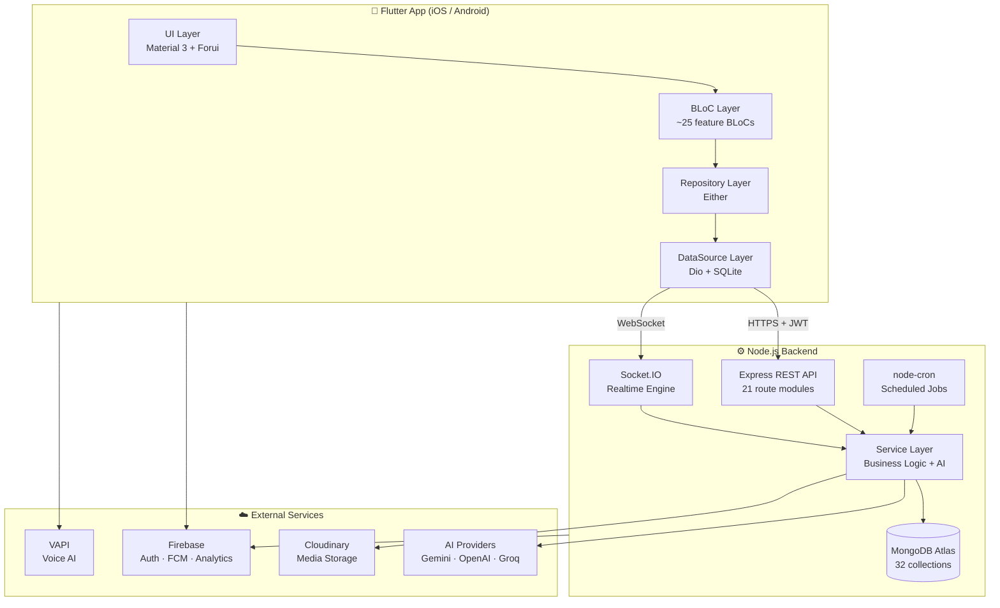

# English for Community (E4C)

> **Full-stack AI-powered English learning platform** — built for real classroom use with **Flutter** (mobile), **Node.js** (API), **MongoDB**, **Firebase**, and **Socket.IO** realtime.


---

## What is this?

A **production-grade English learning platform** that goes beyond typical CRUD apps. It connects **teachers**, **students**, and **admins** in a unified ecosystem with:

- **4 core language skills** (Listening, Speaking, Reading, Writing) + Vocabulary
- **Real-time exam sessions** with live proctoring and student screen mirroring
- **AI-powered grading** (Gemini, OpenAI, Groq) for writing & speaking assessment
- **Classroom management** — teachers create classes, assign exams, track progress
- **Gamification** — streaks, XP points, levels, daily goals
- **Bilingual UI** — English & Vietnamese with ARB-based localization

This demonstrates end-to-end product ownership: from UX design and mobile architecture to REST API, WebSocket realtime, AI integrations, and admin tooling.

---

## Key Highlights (for Recruiters)

| Area | What it demonstrates |
|------|---------------------|
| **Architecture** | Clean Architecture with BLoC pattern, Repository layer, Either-based error handling |
| **Multi-role system** | 3 distinct user experiences (Student, Teacher, Admin) in one codebase with role-based routing |
| **Realtime** | Socket.IO for live exam sessions, student presence tracking, screen mirroring |
| **AI Integration** | Multi-provider AI (Gemini, OpenAI, Groq) for auto-grading, feedback, and voice AI (VAPI) |
| **Scale** | 32 database models, 21 API route files, 60+ pages, full CMS for content management |
| **Security** | JWT dual-token (access + refresh), auto-refresh interceptor, RBAC middleware, rate limiting |
| **Offline** | SQLite dictionary (50k+ words), secure token storage, local notifications |

---

## System Architecture



---

## Features by Role

### Student

| Feature | Description |
|---------|-------------|
| **Skill Practice** | Listening dictation, reading comprehension, writing tasks, speaking (record + AI score) |
| **Exam Taking** | Join live exam sessions via code/link, timed multi-skill integrated exams |
| **Live Session** | Real-time lobby → countdown → exam → auto-submit with integrity tracking |
| **Classroom** | Join teacher's class, view assignments, track personal scores |
| **AI Assistant** | Chat-based learning help powered by Gemini |
| **Vocabulary** | Personal word bank + SRS (Spaced Repetition) review |
| **Free Speaking** | Voice conversation with AI tutor via VAPI |
| **Gamification** | Daily goals, XP, streaks, levels, progress charts |

### Teacher

| Feature | Description |
|---------|-------------|
| **Dashboard** | Overview of classes, upcoming sessions, recent activity |
| **Exam Builder** | Create multi-skill exams (MCQ, fill-blank, essay, listening, reading, grammar) |
| **Integrated Exam Editor** | Build complex exams with multiple skill sections in one exam |
| **Live Exam Console** | Start/pause/end sessions, monitor students in real-time, kick cheaters |
| **Student Live Screen** | Mirror student's exam screen in real-time during proctored sessions |
| **Grading Hub** | Grade essays with AI assistance, manual override, batch operations |
| **Gradebook** | Track all students' scores across assignments with export (Excel) |
| **Classroom Management** | Create classes, invite via code/link, approve members, add co-teachers |
| **Calendar** | Schedule exam sessions, view upcoming deadlines |
| **Assignment Wizard** | Assign exams to classes with due dates, attempts config, scheduling |
| **Analytics** | Performance breakdown per student and per skill |

### Admin

| Feature | Description |
|---------|-------------|
| **CMS** | Full content management for all 5 skills (CRUD + bulk operations) |
| **User Management** | Search, ban/unban, view activity, role assignment |
| **Teacher Applications** | Review & approve teacher role requests |
| **Submission Review** | Moderate student submissions across all skills |
| **Report Moderation** | Handle user reports and flagged content |
| **Release Management** | Push app version updates, force-update flags |
| **Dashboard** | Real-time user stats, content counts, system health |
| **Audit Logs** | Track admin actions for accountability |

---

## Tech Stack

### Frontend — Flutter

| Category | Technology |
|----------|-----------|
| Language | Dart (SDK ≥ 3.3.0) |
| State Management | `flutter_bloc` + `equatable` |
| DI | `get_it` (Service Locator) |
| Routing | `go_router` (role-based redirect, deep links) |
| Networking | `dio` + JWT auto-refresh interceptor |
| Realtime | `socket_io_client` + lifecycle manager |
| Auth | Firebase Auth + Google Sign-In + JWT |
| Local Storage | `flutter_secure_storage` · `shared_preferences` · `sqflite` |
| AI/Voice | `google_generative_ai` · `vapi` · `speech_to_text` · `flutter_tts` |
| Push | Firebase Cloud Messaging + local notifications |
| UI | Material 3 · `forui` · `flutter_animate` · `fl_chart` · `flutter_markdown` |
| i18n | ARB-based (English + Vietnamese) |

### Backend — Node.js

| Category | Technology |
|----------|-----------|
| Runtime | Node.js (ES Modules) |
| Framework | Express 4 + CORS + Rate Limiting |
| Database | MongoDB (Mongoose 8) with pagination plugin |
| Auth | JWT dual-token + bcrypt + OTP with TTL |
| Realtime | Socket.IO 4 (rooms, auth middleware, live events) |
| AI | `@google/genai` · `openai` · `groq-sdk` |
| Storage | Cloudinary (multer upload) |
| Validation | Zod 4 |
| Email | Nodemailer (OTP, password reset) |
| Push | Firebase Admin SDK |
| Jobs | node-cron (smart notifications) |
| Export | ExcelJS (gradebook export) |

---

## Realtime Architecture (Socket.IO)

The app uses WebSocket for critical real-time features:

```
┌─────────────────────────────────────────────────────────────────┐
│                     Socket.IO Event System                        │
├─────────────────────────────────────────────────────────────────┤
│                                                                   │
│  👤 User Presence                                                │
│     user_login / user_logout → online status + admin broadcast   │
│                                                                   │
│  📝 Live Exam Sessions                                           │
│     join_exam_session → lobby → ready check → start → submit     │
│     exam_live_view_sync → student screen mirrored to teacher     │
│     exam_session_state_broadcast → all participants stay in sync │
│                                                                   │
│  🎧 Collaborative Learning                                       │
│     join_listening_room → shared cue/comment discussions          │
│                                                                   │
│  📊 Assignment Progress                                          │
│     join_exam_assignment_progress → live grading updates          │
│                                                                   │
│  🔔 Notifications                                                │
│     Per-user rooms for targeted push delivery                    │
│                                                                   │
└─────────────────────────────────────────────────────────────────┘
```

---

## Database Schema (32 Models)

```
Users & Auth          Learning Content       Exams & Grading         Classroom
─────────────         ────────────────       ───────────────         ─────────
User                  Listening              Exam                    Classroom
RolePermission        ListeningComprehension ExamSession             ClassroomMember
TeacherApplication    Reading                ExamAttempt             ClassroomActivityLog
AdminAuditLog         SpeakingSet            ExamAssignment
                      WritingTopics          TeacherAssignmentPreset
Progress & Social     WritingTopicVersion
────────────────      Word                   Attempts & Submissions
UserDailyProgress     CueComment             ──────────────────────
Enrollment                                   ReadingAttempt
Notification                                 ReadingProgress
Report                                       WritingSubmission
AppRelease                                   SpeakingAttempt
                                             SpeakingEnrollment
                                             DictationAttempt
                                             ListeningCompAttempt
```

---

## API Endpoints (21 Route Modules)

| Route | Purpose |
|-------|---------|
| `/api/auth` | Register, login, OTP verify, refresh token, password reset |
| `/api/users` | Profile, avatar upload, preferences |
| `/api/teacher` | Teacher dashboard, classrooms, exam CRUD, grading, sessions |
| `/api/exam` | Exam attempts, submissions, live sessions, AI grading |
| `/api/classroom` | Class CRUD, member management, invites, activity logs |
| `/api/listening` | Dictation content + cue/comment |
| `/api/listening-comp` | Comprehension exercises (MCQ) |
| `/api/reading` | Reading passages + exercises |
| `/api/speaking` | Speaking sets, attempts, VAPI config |
| `/api/writing` | Writing topics, submissions, AI feedback |
| `/api/vocab` | Personal word bank, SRS review |
| `/api/progress` | Daily progress, streaks, gamification |
| `/api/chat` | AI assistant conversations |
| `/api/notifications` | Push notifications, preferences |
| `/api/reports` | User reports, moderation |
| `/api/admin` | Admin dashboard, user management, audit |
| `/api/cue` | Collaborative cue/comment system |
| `/api/dictation` | Dictation attempts + scoring |
| `/api/lesson` | Lesson management |
| `/api/app-version` | Version check, force update |
| `/api/admin/releases` | Release management |

---

## Repository Structure

```
english_for_community/
├── english_for_community/          # Flutter App (iOS, Android)
│   ├── lib/
│   │   ├── core/                   # Shared infrastructure
│   │   │   ├── api/                # Dio client, JWT interceptor
│   │   │   ├── entity/             # Domain entities (Equatable)
│   │   │   ├── datasource/         # Remote & local data access
│   │   │   ├── repository/         # Abstract contracts
│   │   │   ├── repository_impl/    # Concrete implementations
│   │   │   ├── get_it/             # DI container
│   │   │   ├── router/             # GoRouter + auth guard
│   │   │   ├── socket/             # Socket.IO lifecycle
│   │   │   ├── theme/              # Material 3 design system
│   │   │   └── ui/                 # Shared widgets
│   │   ├── feature/                # Feature modules
│   │   │   ├── auth/               # Login, register, OTP
│   │   │   ├── home/               # Student dashboard
│   │   │   ├── listening/          # Dictation practice
│   │   │   ├── listening_comp/     # Comprehension MCQ
│   │   │   ├── speaking/           # Speech recognition + AI
│   │   │   ├── reading/            # Passages + exercises
│   │   │   ├── writing/            # Essay + AI feedback
│   │   │   ├── vocabulary/         # Word bank + SRS
│   │   │   ├── student/            # Exams, classes
│   │   │   ├── teacher/            # Full teacher workspace
│   │   │   ├── admin/              # CMS + management
│   │   │   ├── progress/           # Charts + gamification
│   │   │   └── profile/            # User settings
│   │   └── l10n/                   # Localization (EN/VI)
│   └── assets/                     # Fonts, images, SQLite DB
│
├── english_for_community_backend/  # Node.js API
│   ├── src/
│   │   ├── routes/                 # 21 Express route modules
│   │   ├── controllers/            # Request handlers (thin)
│   │   ├── services/               # Business logic + AI
│   │   ├── models/                 # 32 Mongoose schemas
│   │   ├── middleware/             # Auth, RBAC, rate limit
│   │   ├── socket/                 # Socket.IO events
│   │   ├── jobs/                   # Scheduled tasks
│   │   └── config/                 # Firebase, Cloudinary
│   └── server.js                   # Entry point
│
└── docs/                           # Project documentation
```

---

## Getting Started

### Prerequisites

- Flutter SDK ≥ 3.3.0
- Node.js ≥ 18
- MongoDB Atlas account (or local MongoDB)
- Firebase project (Auth + FCM + Analytics)

### Backend

```bash
cd english_for_community_backend
npm install
cp .env.example .env    # Fill in your secrets
npm run dev             # Start with nodemon
```

### Flutter App

```bash
cd english_for_community
flutter pub get
flutter run
```

### Seed Demo Data

```bash
npm run seed:full-demo  # Creates admin + teacher + student with sample data
```

---

## Engineering Practices

- **Error Handling**: `Either<Failure, T>` pattern — no exceptions escape the repository layer
- **Dependency Injection**: Single registration point in `get_it.dart` — easily testable
- **Token Security**: `flutter_secure_storage` for tokens, auto-refresh interceptor for seamless UX
- **Offline Support**: SQLite dictionary works without internet, secure token persistence
- **Code Organization**: Feature-first folder structure, one BLoC per concern
- **Type Safety**: Equatable entities, sealed states, exhaustive pattern matching
- **Realtime Reliability**: Socket auth middleware, auto-reconnect, graceful disconnect handling

---

## License

This is a portfolio/personal project. If you're a recruiter and want a deeper walkthrough of any module (BLoC architecture, API contracts, realtime flow, AI integration), feel free to request a demo or code review session.

---

<p align="center">
  <strong>English for Community</strong><br/>
  <em>Flutter · Node.js · MongoDB · Firebase · Socket.IO · AI-Powered Learning</em>
</p>
