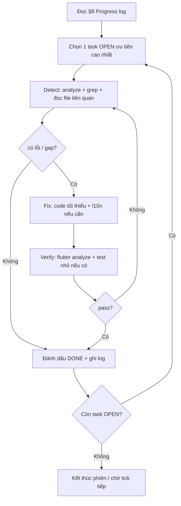

# Agent Autonomous Workflow — E4C

> **Mục đích:** Tài liệu này là **single playbook** cho AI agent (Cursor Background / `/loop`) chạy **tự dò lỗi → tự sửa → tự kiểm tra** trên toàn app, không cần hỏi lại user từng bước.
>
> **Đối tượng:** Agent làm việc qua đêm hoặc nhiều phiên liên tiếp. User chỉ cần mở file này và paste prompt ở [§9](#9-prompt-mẫu-để-chạy-tự-động).

**Tham chiếu bắt buộc trước khi sửa code:**

| Tài liệu | Đường dẫn |
|----------|-----------|
| Project context | `.cursor/rules/project.mdc` |
| Nghiệp vụ & gap | `docs/00-nghiep-vu-tong-hop-va-khoang-trong.md` |
| UI guardrails | `docs/ui-ux-system/12-ai-guardrails.md` |
| Token → code | `docs/ui-ux-system/11-implementation-mapping.md` |
| Mobile screens | `docs/ui-ux-system/05-mobile-screens.md` |
| Smart patterns | `docs/ui-ux-system/15-mobile-smart-patterns.md` |
| Thông báo | `docs/notifications-teacher-student.md` |
| Seed test | `docs/seed-hoangdong-accounts.md`, `docs/seed-test-accounts.md` |

---

## 1. Nguyên tắc vận hành

1. **Doc thắng code cũ** — Vi phạm UI/UX spec → sửa code, không sửa doc theo code tệ.
2. **Server là sự thật** — Thời gian thi, trạng thái nộp, quyền truy cập: UI chỉ hiển thị theo API.
3. **Minimize scope** — Mỗi commit/PR nhỏ, 1 mục tiêu rõ; không refactor lan man.
4. **Không commit secret** — `.env`, token, credential không vào git.
5. **Không commit trừ khi user yêu cầu** — Qua đêm: ghi log vào [§8 Progress log](#8-progress-log); user commit sáng.
6. **L10n** — Chuỗi UI mới → `app_en.arb` + `app_vi.arb` → `flutter gen-l10n`.
7. **Nghiệp vụ suy luận hợp lý** — Khi doc thiếu chi tiết, agent áp dụng [§3 Giả định nghiệp vụ](#3-giả-định-nghiệp-vụ-agent-được-phép-tự-quyết).

---

## 2. Danh mục chức năng (backlog đầy đủ)

Trạng thái mặc định khi bắt đầu qua đêm: xem cột **Ghi chú**. Agent cập nhật cột **Trạng thái** trong [§8](#8-progress-log) sau mỗi vòng.

### 2.1 Ổn định kỹ thuật (Phase 0 — làm trước)

| ID | Chức năng / việc | Mô tả | Ưu tiên | Ghi chú |
|----|------------------|-------|---------|---------|
| P0-1 | Layout overflow | Sửa `RenderFlex` overflow (AppBar + TabBar, `PreferredSize` + `Column`) | P0 | Đã sửa `vocabulary_home_page`; còn `edit_profile_page`, `reading_detail_page`, `free_speaking_page` |
| P0-2 | `flutter analyze` warnings | Dọn unused import, dead code, unnecessary cast | P0 | ~51 warning, 0 error (baseline) |
| P0-3 | Deprecated API | `withOpacity`→`withValues`, `value`→`initialValue`, `onPopInvoked`→`onPopInvokedWithResult`, Radio→RadioGroup | P1 | ~93 info |
| P0-4 | Debug `print` production | Xóa `print("DEBUG…")` trong admin/feature | P1 | |
| P0-5 | Smoke route map | Login → Home → 5 skills → Vocab → 1 exam → Profile → Noti | P0 | Ghi route lỗi vào log |

### 2.2 Học sinh — Mobile UI (`StudentMobileUi` + spec `05`)

| ID | Chức năng | Việc cần làm | Doc |
|----|-----------|--------------|-----|
| S-01 | Onboarding | 3 slide, indicator, CTA 48dp, skill màu slide 1–3 | `05§1.2` |
| S-02 | Auth (login/register/OTP/forgot/reset) | Form 48dp, Google outlined, `StudentMobileUi` | `05§1.3` |
| S-03 | Home | Greeting body (không title AppBar), streak accent, skill grid accent, pull-to-refresh skeleton | `05§2` |
| S-04 | Listening hub + list | `skillAppBar`, filter chip, list card thumbnail | `05§3.1` |
| S-05 | Listening dictation skill | Runner header phẳng, bottom bar | `05§4` |
| S-06 | Listening comprehension | Migrate UI (`listening_comp_page`, list) | `05§3.1` |
| S-07 | Speaking hub | Segmented 3 mode, list set | `05§3.2` |
| S-08 | Speaking lesson / free | AppBar + bottom bar spec | `05§4` |
| S-09 | Reading list + detail | Tab Article/Question, body 14/400 textPrimary | `05§3.3`, `05§4` |
| S-10 | Writing topics + task + feedback | Task chip, MCQ/bottom bar, review colors | `05§3.4` |
| S-11 | Vocabulary home | TabBar AppBar.bottom (đã fix overflow); cân nhắc 3 tile vs tab — **giữ tab** nếu không có lệnh đổi | `05§6` |
| S-12 | Dictionary + SRS review | Search sticky, flip card 4 nút SRS | `05§6.2–6.3` |
| S-13 | Progress | Hero chart, breakdown 4 skill | `05§7` |
| S-14 | Profile | Hero 64, sections 56dp, teacher apply block | `05§8` |
| S-15 | Exercise history | Tab filter skill, date chip | `05` |
| S-16 | Notification center | Unread dot, 2-line body, deep link | `05§9` |
| S-17 | AI assistant dialog | Compact, l10n | `05` |
| S-18 | My classes hub | Empty/error/retry, classroom card | `03-classroom` |
| S-19 | Classroom detail | Tabs assignments/members theo spec | teacher `03` |
| S-20 | Exam assignments list | Card trạng thái, due date chip | `05§5` |
| S-21 | Exam session lobby | Countdown hero, meta cards, Join CTA | `05§5.1` |
| S-22 | Integrated exam runner | Hub skill + grammar sheet 90% | `05§5.2–5.3` |
| S-23 | Exam runner (legacy/classic) | Chỉ polish nếu còn route; không mở rộng nghiệp vụ mới | legacy |
| S-24 | Public exam join | Rate limit UX, error copy server | F10 |
| S-25 | Exam answer review | Border 1px, padding 14, textPrimary body | `11§3` |

**Màn ưu tiên migrate (ít `StudentMobileUi` hiện tại):** `listening_comp_page`, `listening_skills_page`, `integrated_exam_runner_page`.

### 2.3 Thông báo (Phase 2)

| ID | Chức năng | Việc |
|----|-----------|------|
| N-01 | Socket `user_login` + room | Học sinh/GV connect khi auth |
| N-02 | `new_notification` → bloc/inbox | Realtime cập nhật danh sách |
| N-03 | Foreground banner | Mobile: local notification; Web: SnackBar (`AppNotificationListener`) |
| N-04 | FCM background | Token register, multicast từ BE |
| N-05 | Deep link navigation | Mọi `type` trong `notification_navigation.dart` |
| N-06 | Mark read / badge | Home bell + dialog |
| N-07 | E2E seed test | Teacher Hoàng Đông giao bài → student nhận (xem `seed-hoangdong-accounts.md`) |

### 2.4 Giáo viên — Web (`TeacherWebUi`, spec `08`)

| ID | Mã nghiệp vụ | Chức năng | Việc |
|----|--------------|-----------|------|
| T-01 | F1 | Teacher apply + admin duyệt | Audit log, lý do từ chối UI |
| T-02 | F2 | Classroom CRUD | Members, rotate code, archive — polish UX |
| T-03 | F3 | **Exam builder skills + Grammar** | Toggle từng skill; Grammar MCQ block; publish validation |
| T-04 | F5 | Assign + public link | Wizard, maxUses, expires, rotate, close |
| T-05 | F6 | Student runner grammar | MCQ trong thi; autosave; điểm khớp BE |
| T-06 | F7 | Scheduled window | Disable Start + copy lỗi = server |
| T-07 | F8 | Realtime session | Lobby→live→closed; reconnect |
| T-08 | F9 | Grading hub | Auto/AI/manual; batch release |
| T-09 | F10 | Integrity | Tab blur telemetry (optional); public join rate limit UX |
| T-10 | F11 | Analytics | KPI tối thiểu, empty states |
| T-11 | — | Teacher dialogs | `TeacherDialogShell`, assign exam, grading hub labels (`14-teacher-dialogs`) |
| T-12 | — | Live session console | Tabs-first layout (`13-teacher-live-session-console`) |

### 2.5 Admin — Web

| ID | Chức năng | Việc |
|----|-----------|------|
| A-01 | Dashboard | `AdminWebUi`, KPI không dùng webH1 cho số |
| A-02 | User management | Tab trash, RBAC |
| A-03 | Content CMS | 5 skills CRUD — token đen, không teal |
| A-04 | Submissions / reports | List density spec `07` |
| A-05 | Teacher applications | Duyệt/từ chối F1 |
| A-06 | App release management | Candidate → approve → publish (`auto-update/07`) |
| A-07 | Ops center | Giữ ổn định, không thêm mobile layout |

### 2.6 Design system & components (Phase 4)

| ID | Chức năng | Việc |
|----|-----------|------|
| D-01 | PR1 Tokens | `app_spacing`, `app_motion`, `*Bg`, tint getters |
| D-02 | PR2 Typography | body → `textPrimary`; web merge workspace |
| D-03 | PR3 ExamSystemUi | hPadding 16, cardGap 12, caption body textPrimary |
| D-04 | PR4 AppCard | radius 12, border 1px, shadow e.0/e.1 |
| D-05 | PR4 AppChip | **Tạo** `core/ui/widget/app_chip.dart` (filter/tag/status) |
| D-06 | PR4 Skeleton | Shimmer gradient outlineMuted↔outline |
| D-07 | PR5 Touch-up | Reading detail, exam review, profile font |
| D-08 | PR6 Web layout | `web_sidebar`, `web_page_header` (khi cần) |

### 2.7 Mobile smart patterns (Phase 5 — sau UI ổn)

| ID | Chức năng | Việc |
|----|-----------|------|
| M-01 | `AppHaptic` | `core/ui/app_haptic.dart` + MCQ/submit |
| M-02 | MCQ feedback animation | Scale đúng / shake sai trên `mcqOption` |
| M-03 | Bottom sheet sizes | peek / half / expanded (`StudentBottomSheet`) |
| M-04 | Streak celebrate | Milestone ≥7 ngày |
| M-05 | Coachmark (optional) | Home lần đầu |

### 2.8 Auto-update app

| ID | Chức năng | Việc |
|----|-----------|------|
| U-01 | Version check client | Soft/force dialog, changelog, store URL |
| U-02 | Check frequency / cache | Không spam API |
| U-03 | Admin release UI | Đối chiếu spec `auto-update/07` |
| U-04 | CI → candidate | Pipeline gọi `ci-candidates` |

### 2.9 Backend hỗ trợ

| ID | Chức năng | Việc |
|----|-----------|------|
| B-01 | Notification hooks | Assign/approve/release → socket + FCM |
| B-02 | Exam publish validation | Subset skills + grammar MCQ |
| B-03 | Seed / login repair | `checkSeedLogin`, `repairSeedLogins` |
| B-04 | Scoring grammar | `examAttemptScoreUtils` khớp Flutter |

---

## 3. Giả định nghiệp vụ (agent được phép tự quyết)

Khi spec không nói rõ, agent **mặc định** như sau (không hỏi user):

| Tình huống | Quyết định mặc định |
|------------|---------------------|
| Vocabulary home: tab vs 3 tile | **Giữ 3 tab** (Recently / Learning / Saved) — đã có data model; tile chỉ khi user đổi spec |
| Đề thi mới | **Chỉ luồng skills + Grammar MCQ**; classic runner chỉ maintain legacy |
| Publish exam | Ít nhất **1 phần bật**; mọi phần bật phải có content ID hợp lệ |
| Grammar | Chỉ **trắc nghiệm**, chấm tự động, không speaking/writing trong grammar block |
| Giao bài classroom | Chỉ **active** `ClassroomMember` nhận notification |
| Kết quả thi | Học sinh chỉ xem khi `released` hoặc policy `after_submit` |
| Scheduled | Nút Start **disabled** ngoài cửa sổ; message = message từ API |
| Realtime | Không start attempt trước khi teacher `start session` |
| UI lỗi mạng | SnackBar + retry; list: `StudentMobileUi.errorBanner` |
| Empty list | Icon skill + title + CTA (vd. "Tra từ điển", "Tham gia lớp") |
| Teacher trên mobile | Chỉ notification/inbox tối thiểu; **không** làm full teacher CMS trên phone |
| Admin | **Web only** |

---

## 4. Workflow tự động (Detect → Fix → Verify)

### 4.1 Vòng lặp chính (mỗi “tick” agent)



### 4.2 Detect — lệnh chuẩn (chạy mỗi tick đầu hoặc sau mỗi fix lớn)

**Flutter (từ `english_for_community/`):**

```powershell
cd d:\Workspace\english_for_community\english_for_community
flutter analyze 2>&1 | Tee-Object -FilePath ..\docs\.agent-analyze-last.txt
```

**Grep nhanh — pattern hay gây lỗi:**

```powershell
# Overflow risk: Column inside PreferredSize without AppBar.bottom
rg "PreferredSize\(\s*\n\s*preferredSize.*\n\s*child: Column" lib/feature -g "*.dart"

# Hardcoded colors in feature (vi phạm guardrail)
rg "Color\(0x" lib/feature -g "*.dart"

# textSecondary on body (rà soát thủ công từng hit)
rg "textSecondary" lib/feature -g "*.dart" | Select-Object -First 50

# Debug print
rg "print\(" lib -g "*.dart" | rg -v "//.*print"
```

**Backend (từ `english_for_community_backend/`):**

```powershell
cd d:\Workspace\english_for_community\english_for_community_backend
node --check src/services/notificationService.js 2>&1
# Nếu có script test: npm test (chỉ khi package.json định nghĩa)
```

### 4.3 Fix — quy tắc

| Loại lỗi | Cách sửa |
|----------|----------|
| RenderFlex overflow | `AppBar` + `bottom: PreferredSize(height: 50)`; tránh `Column` bọc cả AppBar+TabBar trong 1 `PreferredSize` cứng |
| Analyze warning | Sửa đúng file warning; không disable lint hàng loạt |
| Missing l10n | Thêm key EN+VI, `flutter gen-l10n` |
| Missing empty/error | `StudentMobileUi.emptyState` / `errorBanner` |
| Business gap có API | UI + bloc trước; nếu thiếu API thì service BE mỏng + zod |
| Conflict doc/code | Sửa code theo doc (`12-ai-guardrails`) |

### 4.4 Verify — tiêu chí “xong” 1 task

- [ ] `flutter analyze`: **0 error**; không tăng **warning** (hoặc giảm)
- [ ] File sửa không thêm hex trong `lib/feature/**`
- [ ] Chuỗi UI mới có EN+VI
- [ ] Ghi 1 dòng vào [§8 Progress log](#8-progress-log)
- [ ] Nếu sửa UI màn học sinh: khớp ít nhất 1 mục checklist `12-ai-guardrails` §5

### 4.5 Thứ tự phase (không nhảy cóc trừ khi P0 blocker)

```
Phase 0 (P0-*) → Phase 1 (S-*) theo ID → Phase 2 (N-*) → Phase 4 (D-*) song song nhẹ
→ Phase 3 (T-*, ưu tiên F3,F6,F7,F8) → Phase 5 (M-*) → Phase 6 (A-*, U-*) → Phase 7 (B-*)
```

**Trong một đêm:** hoàn thành **toàn bộ Phase 0** + **tối đa có thể S-01…S-16** + **N-01…N-05**; Phase 3 F3/F6 chỉ khi 0 analyze warning và không còn overflow.

---

## 5. Ma trận ưu tiên khi conflict thời gian

| Ưu tiên | Nhóm | Lý do |
|---------|------|-------|
| 1 | P0 overflow + analyze errors | App crash / CI đỏ |
| 2 | S-03 Home, S-18–S-22 Exam/Class | Luồng học chính |
| 3 | N-* Notifications | Trải nghiệm lớp học realtime |
| 4 | S-04–S-10 Skills | Nội dung học tập |
| 5 | T-03, T-05 Exam builder/runner | Nghiệp vụ GV cốt lõi |
| 6 | D-* Design system | Nền cho PR sau |
| 7 | M-*, U-*, A-* polish | Sau khi ổn định |

---

## 6. Checklist chất lượng mỗi màn (copy cho agent)

```markdown
### Màn: <tên> — <file>
- [ ] AppBar: toolbarHeight 52 hoặc skillAppBar
- [ ] Body text: textPrimary, 14/400 mobile
- [ ] Loading: skeleton hoặc progress có ngữ cảnh
- [ ] Empty: icon + title + CTA
- [ ] Error: retry + message từ Failure/API
- [ ] Không Color(0x...) trong feature
- [ ] Không overflow yellow/black (test 360×640)
- [ ] l10n EN + VI
```

---

## 7. Rủi ro & giới hạn

| Giới hạn | Xử lý |
|----------|--------|
| Agent không chạy khi Cursor tắt | User dùng **Background Agent** hoặc **`/loop`** (§9) |
| Không test device thật | Dựa analyze + logic review; ghi "NEEDS_DEVICE_TEST" trong log |
| BE cần Mongo/FCM | Ghi "NEEDS_ENV"; dùng seed doc, không đoán credential |
| Task quá lớn (F3 full) | Chia sub-task trong log: F3a toggle UI, F3b BE validation, … |

---

## 8. Progress log

> Agent **append** mỗi khi hoàn thành hoặc blocked. Format cố định.

```text
YYYY-MM-DD HH:mm | <ID> | DONE|BLOCKED|IN_PROGRESS | <1 dòng mô tả> | analyze: E=0 W=xx
```

### Log (agent ghi tiếp bên dưới)

```text
2026-05-23 | P0-1 | DONE | vocabulary_home_page AppBar.bottom fix overflow | E=0 W=51
2026-05-23 | — | NOTE | Baseline flutter analyze: 0 errors, 51 warnings, 93 infos
2026-05-23 12:00 | P0-2 | DONE | 51→0 warnings: unused imports, dead code, cue_bloc emit event, flutter_lints enabled | E=0 W=0
2026-05-23 12:15 | P0-1 | DONE | edit_profile AppBar.bottom; reading_detail tab+accent; free_speaking title/actions ellipsis | E=0 W=0
2026-05-23 12:20 | P0-4 | DONE | Removed DEBUG print in admin_listening_list_view | E=0 W=0
2026-05-23 14:00 | P0-3 | DONE | withOpacity→withValues; RadioGroup; Dropdown initialValue; onPopInvokedWithResult; Switch activeThumbColor | E=0 W=0 infos~139 (flutter_lints)
2026-05-23 14:10 | P0-5 | DONE | Smoke route map (code review): /onboarding→/login→/homePage→/listening-list→/speaking-hub→/reading-list→/writing-topics→/vocabulary→/student/exams→/profile — NEEDS_DEVICE_TEST
2026-05-23 14:15 | S-01 | DONE | Onboarding: hero 240, dots 6dp, body textPrimary, CTA 48dp, skill accent slides 1–3 | E=0 W=0
2026-05-23 14:15 | S-02 | DONE | Auth pages already use AuthFormUi + StudentMobileUi (prior pass) | E=0 W=0
2026-05-23 14:25 | S-03 | DONE | Home pull-to-refresh (profile + progress week); greeting/stats/skill grid already spec | E=0 W=0
2026-05-23 14:25 | N-01 | DONE | Socket user_login in AppNotificationListener + socket_service (existing) | E=0 W=0
2026-05-23 14:25 | N-02 | DONE | new_notification → NotificationBloc via AppNotificationListener (existing) | E=0 W=0
2026-05-23 14:25 | N-03 | DONE | Foreground SnackBar + local notification service (existing) | E=0 W=0
2026-05-23 14:25 | N-04 | DONE | FCM setup in home_page init (existing) | E=0 W=0
2026-05-23 14:25 | N-05 | DONE | notification_navigation.dart types wired (existing) | E=0 W=0
2026-05-23 14:25 | N-06 | DONE | Home bell badge + notification dialog (existing) | E=0 W=0
2026-05-23 14:25 | N-07 | BLOCKED | E2E seed Hoàng Đông — NEEDS_ENV (Mongo + running BE) | —
```

---

## 9. Prompt mẫu để chạy tự động

### 9.1 Một lần (Background Agent)

Copy vào Cursor Agent (để chạy lâu):

```text
Đọc và làm theo đúng thứ tự docs/agent-autonomous-workflow.md.

Quy tắc:
- Tuân .cursor/rules/project.mdc và docs/ui-ux-system/12-ai-guardrails.md
- Mỗi task: Detect (flutter analyze + grep) → Fix tối thiểu → Verify → ghi §8 Progress log
- Phase 0 trước, rồi S-* theo ID, rồi N-*
- Nghiệp vụ thiếu spec: dùng §3 giả định
- Không git commit trừ khi tôi yêu cầu
- Hết thời gian: báo cáo bảng task DONE/BLOCKED còn lại

Bắt đầu ngay từ P0-2 (analyze warnings), sau P0-1 các file overflow còn lại.
```

### 9.2 Lặp qua đêm (`/loop` — PowerShell)

Trong terminal Cursor (Windows), có thể arm loop (user tự chạy — agent không arm nếu user không bật):

```powershell
# Ví dụ: mỗi 30 phút đánh thức agent (user paste prompt §9.1 khi thấy tick)
while ($true) {
  Start-Sleep -Seconds 1800
  Write-Output 'AGENT_LOOP_TICK_E4C {"prompt":"Tiếp tục docs/agent-autonomous-workflow.md §4: chọn task OPEN tiếp theo, Detect→Fix→Verify, cập nhật §8 log."}'
}
```

Hoặc dùng Cursor **`/loop 30m`** + prompt §9.1.

### 9.3 Khi user thức dậy

```text
Đọc docs/agent-autonomous-workflow.md §8 Progress log và docs/.agent-analyze-last.txt (nếu có).
Tóm tắt: đã DONE gì, BLOCKED gì, cần tôi test thủ công màn nào.
```

---

## 10. Báo cáo cuối phiên (template agent điền)

```markdown
## Báo cáo autonomous — <ngày>

### Đã hoàn thành
- ...

### Analyze
- Errors: 0
- Warnings: xx (Δ ...)
- Files chính: ...

### BLOCKED (cần user)
- ...

### Cần test thiết bị
- ...

### Đề xuất ưu tiên sáng mai
1. ...
2. ...
```

---

## 11. Liên kết commit / doc

Khi ship xong một mảng lớn, cập nhật:

- `docs/ui-ux-system/11-implementation-mapping.md` — Migration log
- `docs/00-nghiep-vu-tong-hop-va-khoang-trong.md` — Đổi gap → Done (F3, F6, …)
- `docs/teacher-exam-system/11-detailed-feature-implementation-plan.md` — nếu có

---

*File tạo: 2026-05-23 — playbook autonomous E4C.*
