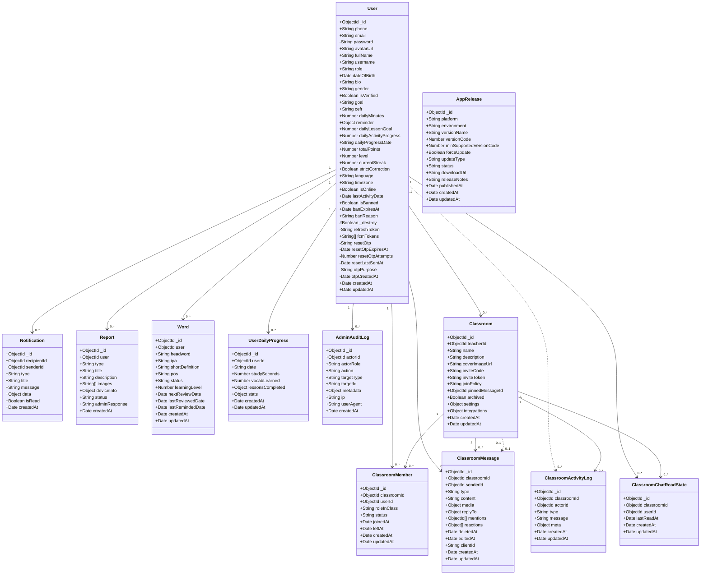
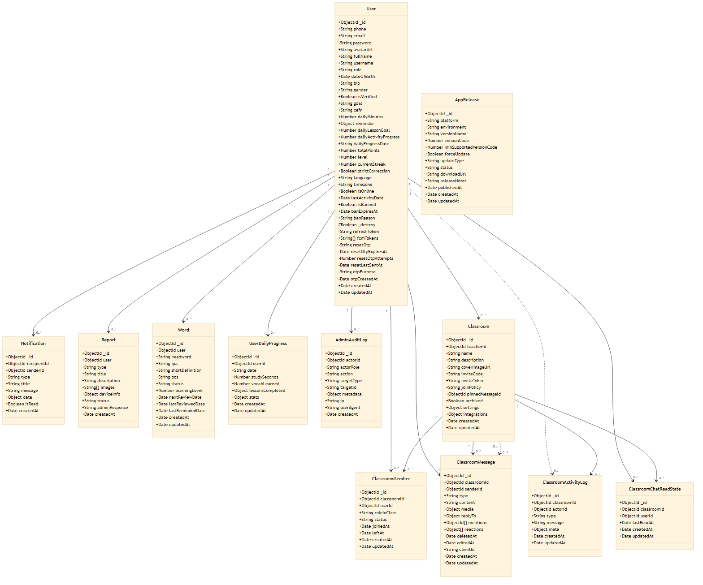
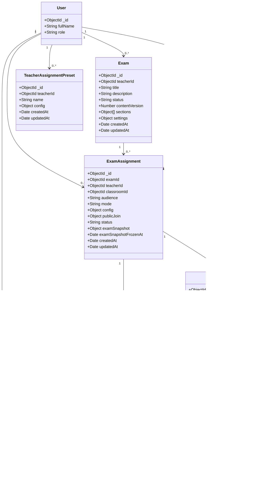
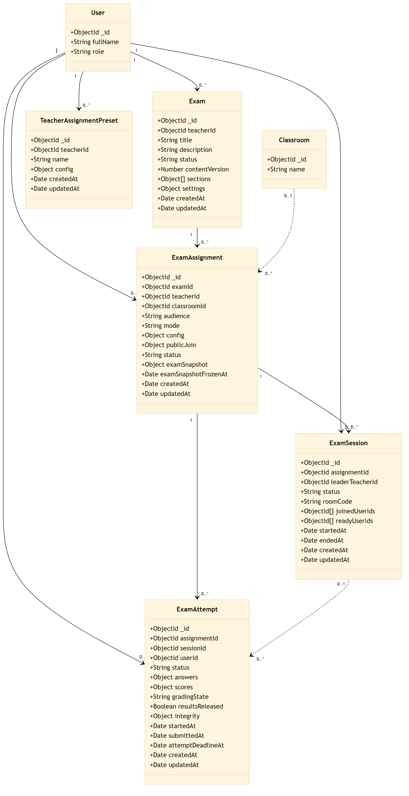
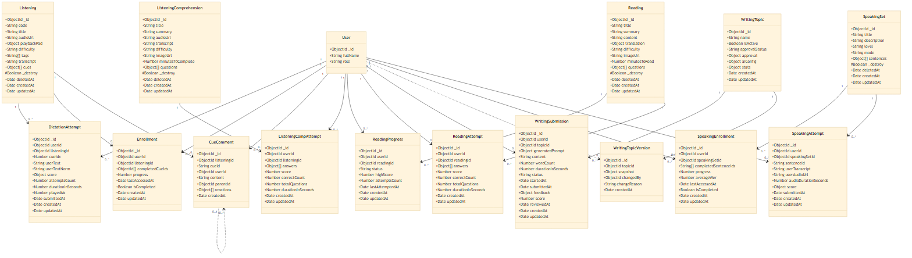

# Lược đồ thực thể kết hợp (ERD) — English for Community

> **32 collection** · MongoDB `english_community`  
> Kiểu **luận văn**: mỗi thực thể dạng **class UML** (`+ObjectId _id`, một cột); quan hệ có **cardinality** (`1`, `0..*`, `0..1`); **không ghi tên FK** trên mũi tên.  
> **Trắng đen** (không tô màu miền). Ký hiệu field: `+` public · `-` private · `#` protected.

**Hướng dẫn Word:** [database-diagrams-for-word.md](../database-diagrams-for-word.md)  
**PlantUML (7 trang):** [plantuml/database-full.puml](../plantuml/database-full.puml)

### Cách xem & sửa

| Việc | Làm gì |
|------|--------|
| **Xem sơ đồ** | Preview file này (Ctrl+Shift+V) hoặc xem PNG bên dưới |
| **Sửa schema** | Sửa [`export/*.mmd`](export/) → chạy [`export/export-erd.ps1`](export/export-erd.ps1) |
| **Chèn Word** | PNG/SVG trong [`export/`](export/) |
| **Copy Mermaid** | Dán khối ```mermaid``` bên dưới vào [mermaid.live](https://mermaid.live) (kèm frontmatter [`erd-frontmatter.yaml`](export/erd-frontmatter.yaml)) |

---

## 2.x.2.1 User, hệ thống, lớp học (Hình 1/3)

12 thực thể · Source: [`export/erd-hinh-1a-user-lop.mmd`](export/erd-hinh-1a-user-lop.mmd)





---

## 2.x.2.2 Đề thi (Hình 2/3)

7 thực thể · Source: [`export/erd-hinh-1b-de-thi.mmd`](export/erd-hinh-1b-de-thi.mmd)





---

## 2.x.2.3 Học tập — Nghe, đọc, viết, nói (Hình 3/3)

15 thực thể · Source: [`export/erd-hinh-2-hoc-tap.mmd`](export/erd-hinh-2-hoc-tap.mmd)

```mermaid
classDiagram
    direction TB

    class User {
        +ObjectId _id
        +String fullName
        +String role
    }
    class Listening {
        +ObjectId _id
        +String code
        +String title
        +String audioUrl
        +Object playbackPad
        +String difficulty
        +String[] tags
        +String transcript
        +Object[] cues
        #Boolean _destroy
        +Date deletedAt
        +Date createdAt
        +Date updatedAt
    }
    class DictationAttempt {
        +ObjectId _id
        +ObjectId userId
        +ObjectId listeningId
        +Number cueIdx
        +String userText
        +String userTextNorm
        +Object score
        +Number attemptsCount
        +Number durationInSeconds
        +Number playedMs
        +Date submittedAt
        +Date createdAt
        +Date updatedAt
    }
    class Enrollment {
        +ObjectId _id
        +ObjectId userId
        +ObjectId listeningId
        +ObjectId[] completedCueIds
        +Number progress
        +Date lastAccessedAt
        +Boolean isCompleted
        +Date createdAt
        +Date updatedAt
    }
    class CueComment {
        +ObjectId _id
        +ObjectId listeningId
        +String cueId
        +ObjectId userId
        +String content
        +ObjectId parentId
        +Object[] reactions
        +Date createdAt
    }
    class ListeningComprehension {
        +ObjectId _id
        +String title
        +String summary
        +String audioUrl
        +String transcript
        +String difficulty
        +String imageUrl
        +Number minutesToComplete
        +Object[] questions
        #Boolean _destroy
        +Date deletedAt
        +Date createdAt
        +Date updatedAt
    }
    class ListeningCompAttempt {
        +ObjectId _id
        +ObjectId userId
        +ObjectId listeningId
        +Object[] answers
        +Number score
        +Number correctCount
        +Number totalQuestions
        +Number durationInSeconds
        +Date createdAt
        +Date updatedAt
    }
    class Reading {
        +ObjectId _id
        +String title
        +String summary
        +String content
        +Object translation
        +String difficulty
        +String imageUrl
        +Number minutesToRead
        +Object[] questions
        #Boolean _destroy
        +Date deletedAt
        +Date createdAt
        +Date updatedAt
    }
    class ReadingProgress {
        +ObjectId _id
        +ObjectId userId
        +ObjectId readingId
        +String status
        +Number highScore
        +Number attemptsCount
        +Date lastAttemptedAt
        +Date createdAt
        +Date updatedAt
    }
    class ReadingAttempt {
        +ObjectId _id
        +ObjectId userId
        +ObjectId readingId
        +Object[] answers
        +Number score
        +Number correctCount
        +Number totalQuestions
        +Number durationInSeconds
        +Date createdAt
        +Date updatedAt
    }
    class WritingTopic {
        +ObjectId _id
        +String name
        +Boolean isActive
        +String approvalStatus
        +Object approval
        +Object aiConfig
        +Object stats
        +Date createdAt
        +Date updatedAt
    }
    class WritingTopicVersion {
        +ObjectId _id
        +ObjectId topicId
        +Object snapshot
        +ObjectId changedBy
        +String changeReason
        +Date createdAt
    }
    class WritingSubmission {
        +ObjectId _id
        +ObjectId userId
        +ObjectId topicId
        +Object generatedPrompt
        +String content
        +Number wordCount
        +Number durationInSeconds
        +String status
        +Date startedAt
        +Date submittedAt
        +Object feedback
        +Number score
        +Date reviewedAt
        +Date createdAt
        +Date updatedAt
    }
    class SpeakingSet {
        +ObjectId _id
        +String title
        +String description
        +String level
        +String mode
        +Object[] sentences
        #Boolean _destroy
        +Date deletedAt
        +Date createdAt
        +Date updatedAt
    }
    class SpeakingEnrollment {
        +ObjectId _id
        +ObjectId userId
        +ObjectId speakingSetId
        +String[] completedSentenceIds
        +Number progress
        +Number averageWer
        +Date lastAccessedAt
        +Boolean isCompleted
        +Date createdAt
        +Date updatedAt
    }
    class SpeakingAttempt {
        +ObjectId _id
        +ObjectId userId
        +ObjectId speakingSetId
        +String sentenceId
        +String userTranscript
        +String userAudioUrl
        +Number audioDurationSeconds
        +Object score
        +Date submittedAt
        +Date createdAt
        +Date updatedAt
    }

    User "1" --> "0..*" DictationAttempt
    User "1" --> "0..*" Enrollment
    User "1" --> "0..*" CueComment
    User "1" --> "0..*" ListeningCompAttempt
    User "1" --> "0..*" ReadingProgress
    User "1" --> "0..*" ReadingAttempt
    User "1" --> "0..*" WritingSubmission
    User "0..1" ..> "0..*" WritingTopicVersion
    User "1" --> "0..*" SpeakingEnrollment
    User "1" --> "0..*" SpeakingAttempt
    Listening "1" --> "0..*" DictationAttempt
    Listening "1" --> "0..*" Enrollment
    Listening "1" --> "0..*" CueComment
    ListeningComprehension "1" --> "0..*" ListeningCompAttempt
    CueComment "0..1" ..> "0..*" CueComment
    Reading "1" --> "0..*" ReadingProgress
    Reading "1" --> "0..*" ReadingAttempt
    WritingTopic "1" --> "0..*" WritingSubmission
    WritingTopic "1" --> "0..*" WritingTopicVersion
    SpeakingSet "1" --> "0..*" SpeakingEnrollment
    SpeakingSet "1" --> "0..*" SpeakingAttempt
```





---

## Ghi chú

| Mục | Giải thích |
|-----|------------|
| **Đủ 32/32** | User + 31 collection còn lại — bảng đối chiếu bên dưới |
| **Hình 1** | User (đủ field) + hệ thống + lớp — 12 thực thể |
| **Hình 2** | Đề thi — 7 thực thể; User rút gọn (tham chiếu) |
| **Hình 3** | Nghe, đọc, viết, nói — 15 thực thể; User rút gọn |
| **Không vẽ** | `RolePermission`, `TeacherApplication` — model cũ |
| **AppRelease** | Không FK tới User |
| Kiểu `objectId` | Tham chiếu MongoDB ObjectId (FK ngầm) |
| Kiểu `object` / `object_array` | Subdocument nhúng (Mongoose embed) |
| Quan hệ `"1" --> "0..*"` | Một–nhiều bắt buộc |
| Quan hệ `"0..1" ..> "0..*"` | Một–nhiều tùy chọn |
| Quan hệ `"0..1" ..> "0..1"` | Một–một tùy chọn |
| **Giới hạn Mermaid** | Không vẽ **chân quạ ER** và **bảng class** trong cùng một diagram |

### Bảng đối chiếu 32 collection

| STT | Collection | Hình ERD |
|:---:|------------|:--------:|
| 1 | User | 1 + 2 + 3 |
| 2 | Notification | 1 |
| 3 | Report | 1 |
| 4 | Word | 1 |
| 5 | UserDailyProgress | 1 |
| 6 | AdminAuditLog | 1 |
| 7 | AppRelease | 1 |
| 8 | Classroom | 1 |
| 9 | ClassroomMember | 1 |
| 10 | ClassroomMessage | 1 |
| 11 | ClassroomActivityLog | 1 |
| 12 | ClassroomChatReadState | 1 |
| 13 | Exam | 2 |
| 14 | ExamAssignment | 2 |
| 15 | ExamSession | 2 |
| 16 | ExamAttempt | 2 |
| 17 | TeacherAssignmentPreset | 2 |
| 18 | Listening | 3 |
| 19 | Enrollment | 3 |
| 20 | DictationAttempt | 3 |
| 21 | CueComment | 3 |
| 22 | ListeningComprehension | 3 |
| 23 | ListeningCompAttempt | 3 |
| 24 | Reading | 3 |
| 25 | ReadingProgress | 3 |
| 26 | ReadingAttempt | 3 |
| 27 | WritingTopic | 3 |
| 28 | WritingSubmission | 3 |
| 29 | WritingTopicVersion | 3 |
| 30 | SpeakingSet | 3 |
| 31 | SpeakingEnrollment | 3 |
| 32 | SpeakingAttempt | 3 |
