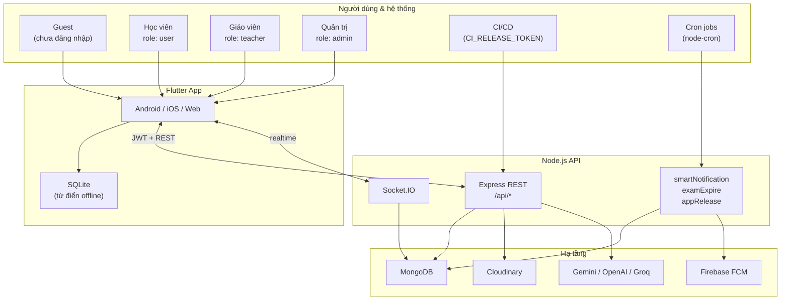
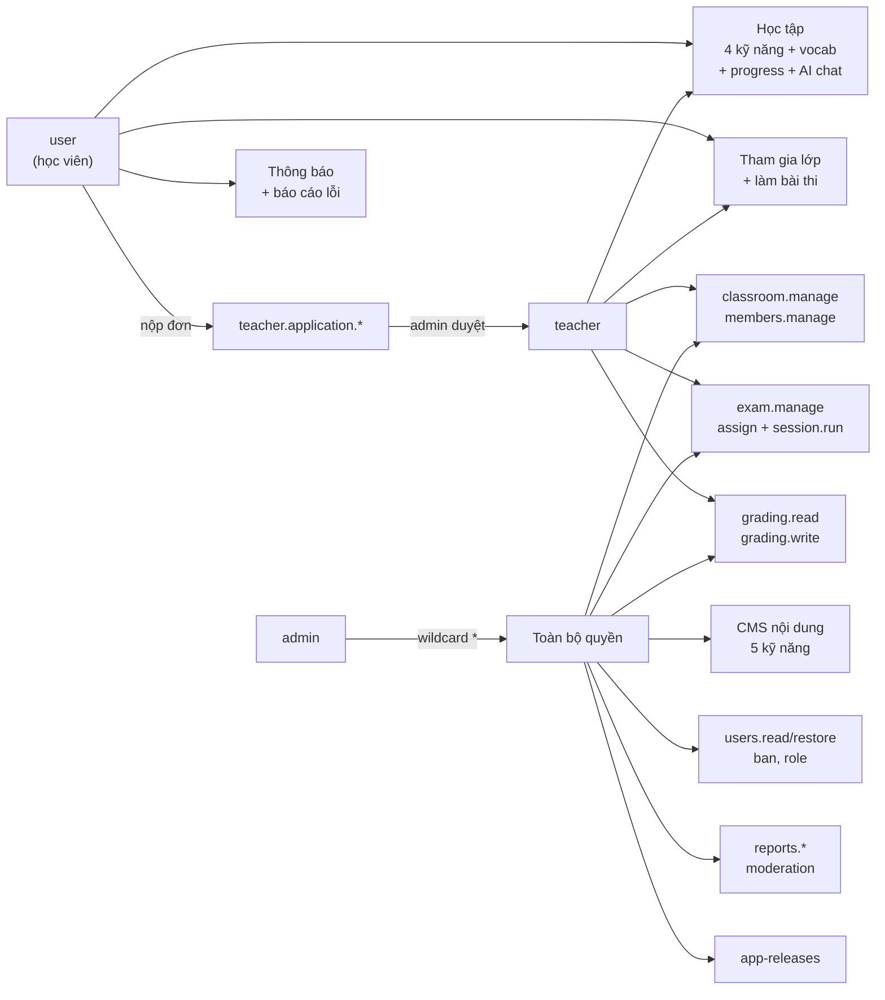
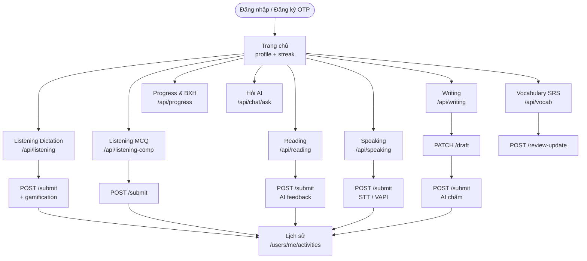
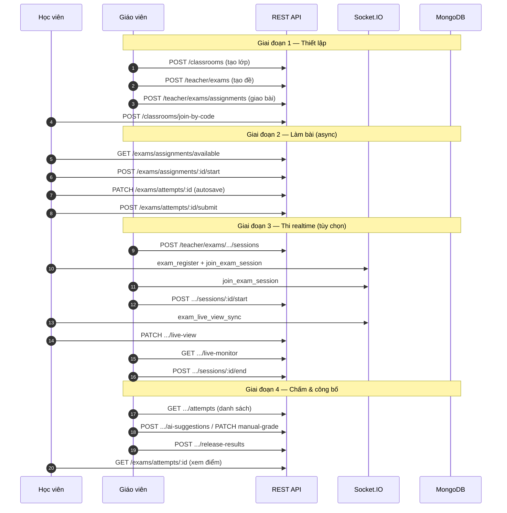
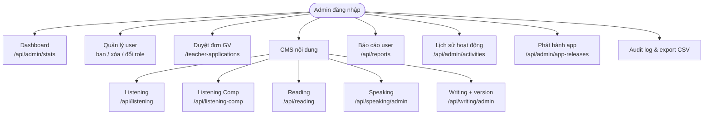
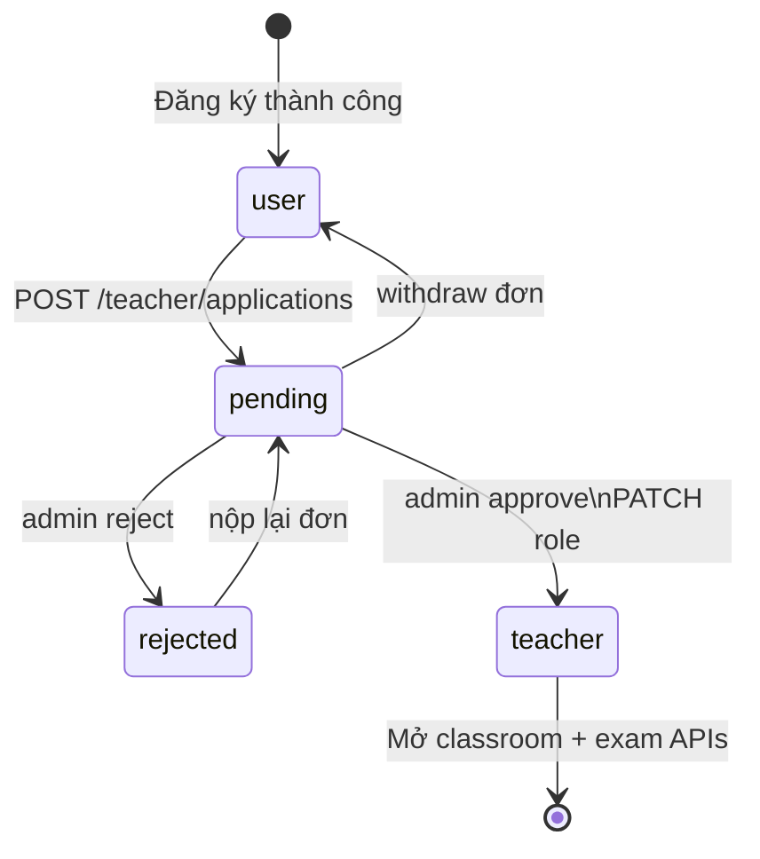
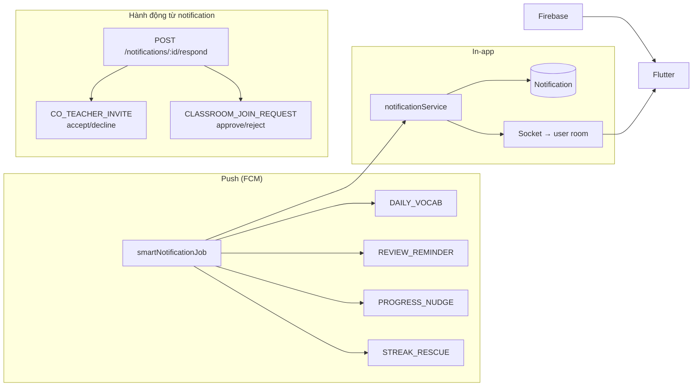
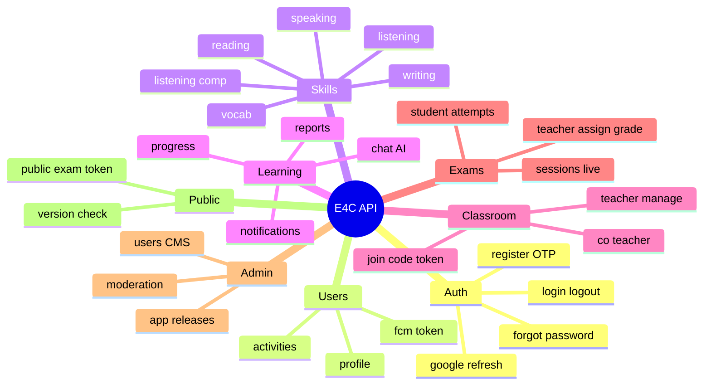

# Sơ đồ use case & kiến trúc — English for Community

> Dựa trên backend `english_for_community_backend/` (routes, `permissions.js`, Socket.IO, cron jobs).  
> Xem trên GitHub / VS Code / Cursor: preview Markdown để render Mermaid.  
> **UML kiểu luận văn:** [use-cases-uml.md](./use-cases-uml.md)

---

## 1. Tổng quan — Actor & hệ thống

---

## 2. Phân quyền theo role (RBAC)

---

## 3. Use case học viên — tự học

---

## 4. Use case lớp học & bài thi

---

## 5. Use case Admin — vận hành

---

## 6. Luồng trở thành giáo viên

---

## 7. Thông báo & realtime

---

## 8. Bản đồ API module (đang mount)

---

## Ghi chú

| Mục | Chi tiết |
|-----|----------|
| Route chưa mount | `dictationRoutes`, `cueRoutes`, `lessonRoutes` — logic cues/dictation đã gộp vào `/api/listening` |
| Guest | Chủ yếu `version-check`; từ điển = offline app |
| Teacher & Admin | Vẫn dùng được API học tập của `user` (chỉ cần JWT) |

**UML Use Case (giống mẫu luận văn):** [use-cases-uml.md](./use-cases-uml.md) — Actor + `<<extend>>` cho User / Teacher / Admin.
