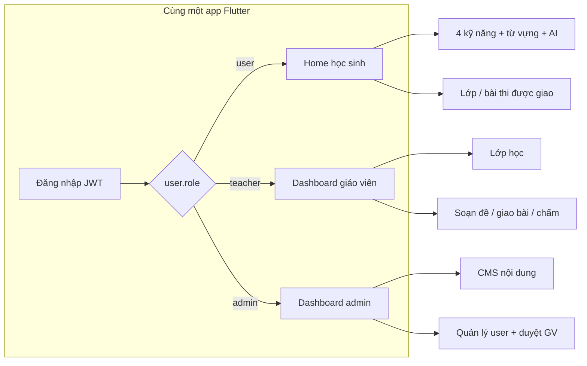

# Báo cáo tiến độ dự án: English for Community (E4C)

> **Ngày báo cáo:** 23/05/2026  
> **Thành viên:** Phan Duy  
> **Repository:** `english_for_community` (monorepo)  
> **Thời gian phát triển:** 14/09/2025 → 22/05/2026 (~8 tháng)  
> **Tổng commits:** 87

---

## 1. Giới thiệu dự án

**English for Community (E4C)** là nền tảng học tiếng Anh toàn diện hỗ trợ AI, tập trung vào 4 kỹ năng giao tiếp cốt lõi: **Listening (Nghe)**, **Speaking (Nói)**, **Reading (Đọc)**, **Writing (Viết)**, kèm **Vocabulary (Từ vựng)**.

### Mục tiêu sản phẩm

- Cung cấp trải nghiệm học tiếng Anh tương tác, cá nhân hóa cho cộng đồng người học Việt Nam
- Tích hợp AI vào quy trình đánh giá và hỗ trợ học tập (chấm bài viết, đánh giá phát âm, trợ lý chat)
- Hỗ trợ 3 vai trò: **Học sinh** (mobile), **Giáo viên** (web/tablet), **Admin** (quản trị nội dung & hệ thống)
- Gamification (điểm, streak, cấp độ) để tăng động lực học tập

---

## 2. Ba vai trò chính trong hệ thống (RBAC)

Hệ thống dùng **một ứng dụng Flutter** cho cả ba vai trò; sau đăng nhập, **GoRouter** đọc trường `role` trên tài khoản và **điều hướng** tới workspace tương ứng. Backend lưu role trong MongoDB (`User.role`) và kiểm tra qua middleware JWT + RBAC (`permissions.js`).

| Mã role (DB/API) | Tên nghiệp vụ | Màn hình mặc định sau login | Module Flutter chính |
|---|---|---|---|
| **`user`** | **Học sinh / Người học** | `HomePage` — hub học tập | `home`, `listening`, `speaking`, `reading`, `writing`, `vocabulary`, `progress`, `profile`, `student/` |
| **`teacher`** | **Giáo viên** | `TeacherDashboardPage` — workspace lớp & thi | `teacher/` (~75 file) |
| **`admin`** | **Quản trị viên** | `AdminDashboardPage` — console vận hành | `admin/` (~102 file) |



### 2.1 Học sinh (`role: user`)

**Đối tượng:** Người học tiếng Anh (mặc định khi đăng ký).

**Nhiệm vụ chính:**

- Học tự chủ qua 4 kỹ năng: nghe (dictation + comprehension), nói (read-aloud + free speaking VAPI), đọc, viết (có phản hồi AI).
- Tra từ điển offline (SQLite), ôn từ vựng SRS, xem tiến độ / streak / điểm / leaderboard.
- Dùng AI assistant, nhận thông báo (FCM + Socket + local).
- **Tham gia lớp giáo viên** (mã mời) và **làm bài thi** được giao (`student/classes`, `student/exams`: lobby, runner, grammar MCQ, link công khai).
- Quản lý hồ sơ cá nhân, lịch sử bài tập.

**Quyền hạn kỹ thuật (backend):**

- Không truy cập API admin hay teacher-only.
- Được phép: `teacher.application.create`, `teacher.application.read_own` (gửi / xem đơn xin làm giáo viên).

**Điều hướng app:** Vào `/homePage`; **bị chặn** `/admin/*` và hầu hết `/teacher/*` (trừ trang **đăng ký làm giáo viên** `TeacherApplyPage`).

---

### 2.2 Giáo viên (`role: teacher`)

**Đối tượng:** Người dạy có lớp học (cohort), giao bài và chấm — **không** phải admin nền tảng.

**Cách có role:** Học sinh (`user`) nộp **đơn làm giáo viên** (`TeacherApplication`) → **admin duyệt** (`approved`) → tài khoản chuyển `role: teacher`.

**Nhiệm vụ chính:**

- **Lớp học (Classroom):** tạo lớp, mã mời, quản lý thành viên, archive, xoay mã.
- **Soạn đề thi:** bài kiểm tra đa kỹ năng — bật/tắt nghe / nói / đọc / viết, gắn nội dung CMS; tùy chọn phần **Ngữ pháp (MCQ)**.
- **Giao bài (Assignment):** giao cho lớp hoặc **link công khai** (giới hạn lượt, hạn).
- **Điều phối thi:** chế độ tự học / theo lịch (scheduled) / **realtime** (lobby → live → kết thúc qua Socket.IO).
- **Chấm & phát hành điểm:** auto (Grammar/MCQ), AI nháp + giáo viên chốt (viết/nói); gradebook, export.
- **Giám sát:** live monitor màn hình học sinh trong phiên thi.

**Quyền hạn kỹ thuật:** Các permission `teacher.*` (classroom, exam, session, assign, grading read/write) — xem `english_for_community_backend/src/constants/permissions.js`.

**Điều hướng app:** Sau login **không** vào Home học sinh mà vào **`/teacher` dashboard**; vẫn mở profile, từ điển; **không** vào `/admin`.

---

### 2.3 Quản trị viên (`role: admin`)

**Đối tượng:** Vận hành nền tảng — quản lý người dùng, nội dung toàn hệ thống, duyệt giáo viên, phát hành app.

**Nhiệm vụ chính:**

- **CMS nội dung:** CRUD bài nghe, nghe hiểu, đọc, nói, viết (nội dung mà giáo viên gắn vào đề thi).
- **Quản lý user:** danh sách, lọc, ban/unban, khôi phục.
- **Duyệt đơn giáo viên:** approve / reject có lý do.
- **Moderation:** báo cáo vi phạm (`reports`), xem lịch sử hoạt động học viên.
- **Phát hành app:** duyệt candidate CI, publish / schedule / rollback phiên bản (`app_update`).
- **Ops & audit:** trung tâm vận hành, nhật ký `AdminAuditLog`.

**Quyền hạn kỹ thuật:** Permission **wildcard** `*` — toàn quyền API admin; middleware `requireAdmin` trên các route `/api/admin/*`.

**Điều hướng app:** Vào **`AdminDashboardPage`**; nếu cố vào Home học sinh sẽ bị redirect về admin.

---

### 2.4 So sánh nhanh & ranh giới trách nhiệm

| Tiêu chí | Học sinh (`user`) | Giáo viên (`teacher`) | Admin (`admin`) |
|---|---|---|---|
| Tạo / sửa bài CMS toàn hệ thống | ❌ | ❌ (chỉ **chọn** bài CMS có sẵn khi soạn đề) | ✅ |
| Tạo lớp & giao bài thi | ❌ (chỉ **làm** bài được giao) | ✅ | ❌ (trừ hỗ trợ vận hành) |
| Học 4 kỹ năng + gamification | ✅ | Có thể dùng từ điển; **không** là luồng chính | ❌ |
| Duyệt đơn giáo viên | ❌ | ❌ | ✅ |
| Chấm bài trong lớp mình | ❌ | ✅ | Có thể xem submission (moderation) |
| Realtime exam (Socket) | Tham gia làm bài | Điều phối phiên | — |

**Lưu ý quan trọng cho báo cáo:**

1. Trong code, học sinh gọi là **`user`**, không phải `student` — `student/` chỉ là **tên module UI** (lớp học & thi phía người học).
2. Giáo viên và học sinh **cùng ecosystem thi/lớp** nhưng **tách workspace UI**; admin **đứng trên** nội dung và tài khoản.
3. Bảo mật: JWT trên mọi API; role + permission trên backend; GoRouter chặn sai route trên client (lớp bảo vệ thứ hai, không thay server).

---

## 3. Quy mô dự án (thống kê mã nguồn)

| Thành phần | Số liệu |
|---|---|
| **Flutter app** — files `.dart` | 412 files |
| **Flutter app** — lines of code | ~89,800 dòng |
| **Backend** — files `.js` | 161 files |
| **Backend** — lines of code | ~20,400 dòng |
| **Tổng cộng** | **~110,200 dòng code** |
| Feature modules (Flutter) | 14 modules |
| BLoC state management classes | 30 BLoC directories |
| Domain entities | 27 entity classes |
| Database models (Mongoose) | 32 models |
| API routes | 21 route files |
| Business services | 46 service files |
| Localization keys | ~1,000+ keys (EN + VI) |

---

## 4. Kiến trúc hệ thống

### 4.1 Tổng quan kiến trúc

```
┌────────────────────────────────────────────────────────────────┐
│                    FLUTTER CLIENT (Mobile)                      │
│  Material 3 + BLoC + GoRouter + GetIt DI + Socket.IO client   │
└──────────────────────────┬─────────────────────────────────────┘
                           │ HTTPS (JWT) + WebSocket
┌──────────────────────────▼─────────────────────────────────────┐
│                   NODE.JS BACKEND (Express)                     │
│   REST API + Socket.IO + Mongoose + AI Services + Jobs         │
└──────────────────────────┬─────────────────────────────────────┘
                           │
         ┌─────────────────┼─────────────────┐
         ▼                 ▼                 ▼
   ┌──────────┐    ┌─────────────┐    ┌──────────────┐
   │ MongoDB  │    │ Cloudinary  │    │   Firebase   │
   │  Atlas   │    │  (Media)    │    │ Auth/FCM/    │
   │          │    │             │    │ Analytics    │
   └──────────┘    └─────────────┘    └──────────────┘
```

### 4.2 Kiến trúc Flutter — Layered Architecture

```
UI Layer (Pages/Widgets)
    ↓ dispatches Events
BLoC Layer (Business Logic)
    ↓ calls
Repository Layer (Abstract → Impl, returns Either<Failure, T>)
    ↓ calls
Datasource Layer (Remote via Dio / Local via SQLite)
```

### 4.3 Kiến trúc Backend — MVC + Service Layer

```
Request → Route → Middleware (Auth/RBAC) → Controller → Service → Model/DB → Response
```

---

## 5. Công nghệ sử dụng

### 5.1 Frontend (Flutter/Dart)

| Hạng mục | Công nghệ |
|---|---|
| Framework | Flutter (Dart SDK ≥ 3.3.0), Material 3 |
| State management | `flutter_bloc` ^9.1.1 |
| Dependency injection | `get_it` ^7.7.0 |
| Navigation | `go_router` ^14.2.7 (declarative, auth redirect) |
| Networking | `dio` ^5.7.0 + JWT interceptor (auto-refresh) |
| Realtime | `socket_io_client` ^2.0.3 |
| Authentication | `firebase_auth`, `google_sign_in`, JWT (access + refresh) |
| Local storage | `flutter_secure_storage`, `shared_preferences`, `sqflite` |
| Push notifications | `firebase_messaging`, `flutter_local_notifications` |
| AI | `google_generative_ai` ^0.4.1, `vapi` ^0.1.0 (voice AI) |
| Audio | `just_audio`, `audioplayers`, `speech_to_text`, `flutter_tts` |
| UI | `forui`, `flutter_animate`, `fl_chart`, `flutter_svg`, `cached_network_image` |
| Localization | ARB-based (EN + VI), `flutter gen-l10n` |
| Fonts | Lexend (primary), NotoSans (fallback) |

### 5.2 Backend (Node.js)

| Hạng mục | Công nghệ |
|---|---|
| Runtime | Node.js (ES Modules) |
| Framework | Express ^4.21.2 |
| Database | MongoDB via `mongoose` ^8.10.0 |
| Auth | JWT (`jsonwebtoken`), `bcrypt`, OTP with TTL |
| Realtime | `socket.io` ^4.8.1 |
| AI | `@google/generative-ai`, `openai`, `groq-sdk` |
| Upload | `multer` + `cloudinary` |
| Validation | `zod` ^4.1.11 |
| Email | `nodemailer` |
| Push | `firebase-admin` |
| Scheduled jobs | `node-cron` |

---

## 6. Tính năng đã hoàn thành

### 6.1 Hệ thống xác thực & phân quyền

| Tính năng | Mô tả | Trạng thái |
|---|---|---|
| Đăng ký / Đăng nhập | Email + password, Google Sign-In | ✅ Hoàn thành |
| OTP Verification | Xác thực email qua OTP (TTL 10 phút) | ✅ Hoàn thành |
| Quên / Đặt lại mật khẩu | OTP → reset password flow | ✅ Hoàn thành |
| JWT Dual-token | Access token (ngắn hạn) + Refresh token + Auto-refresh interceptor | ✅ Hoàn thành |
| Phân quyền (RBAC) | Admin / Teacher / User routing, middleware, GoRouter redirect | ✅ Hoàn thành |
| Google Sign-In | Firebase Auth integration | ✅ Hoàn thành |

### 6.2 Kỹ năng Nghe (Listening)

| Tính năng | Mô tả | Trạng thái |
|---|---|---|
| Listening Dictation | Phát audio → điền chỗ trống → chấm điểm tự động | ✅ Hoàn thành |
| Listening Comprehension | Audio + câu hỏi trắc nghiệm MCQ | ✅ Hoàn thành |
| Audio playback | just_audio / audioplayers, seek, speed control | ✅ Hoàn thành |
| Transcript/Cue system | Hiển thị cue theo timeline, highlight đang phát | ✅ Hoàn thành |
| Discussion (Comments) | Bình luận thảo luận realtime trên bài nghe | ✅ Hoàn thành |
| Dictation attempts | Lưu lịch sử lần làm, scoring | ✅ Hoàn thành |

### 6.3 Kỹ năng Nói (Speaking)

| Tính năng | Mô tả | Trạng thái |
|---|---|---|
| Read Aloud | Đọc theo câu, nhận diện STT, chấm WER | ✅ Hoàn thành |
| Speaking Skills (sets) | Bài theo bộ câu, chấm pronunciation/fluency/accuracy | ✅ Hoàn thành |
| Free Speaking (VAPI) | Hội thoại AI voice qua VAPI service | ✅ Hoàn thành |
| Speech-to-Text | `speech_to_text` plugin → transcript | ✅ Hoàn thành |
| Text-to-Speech | `flutter_tts` cho phát mẫu | ✅ Hoàn thành |
| Speaking attempts | Lưu & đồng bộ điểm lên server | ✅ Hoàn thành |

### 6.4 Kỹ năng Đọc (Reading)

| Tính năng | Mô tả | Trạng thái |
|---|---|---|
| Danh sách bài đọc | Phân loại, lọc theo level | ✅ Hoàn thành |
| Chi tiết bài đọc | Nội dung + câu hỏi comprehension | ✅ Hoàn thành |
| Attempt & scoring | Nộp bài, chấm, lưu tiến độ | ✅ Hoàn thành |
| AI feedback | Phản hồi AI cho bài đọc | ✅ Hoàn thành |

### 6.5 Kỹ năng Viết (Writing)

| Tính năng | Mô tả | Trạng thái |
|---|---|---|
| Writing topics | Danh sách chủ đề viết phân loại | ✅ Hoàn thành |
| Writing task | Giao diện viết bài (timer, word count) | ✅ Hoàn thành |
| AI evaluation | Chấm bài viết bằng AI (grammar, structure, vocabulary) | ✅ Hoàn thành |
| Writing feedback | Hiển thị diff text, gợi ý sửa | ✅ Hoàn thành |
| Writing history | Lịch sử bài viết & điểm | ✅ Hoàn thành |

### 6.6 Từ vựng (Vocabulary)

| Tính năng | Mô tả | Trạng thái |
|---|---|---|
| Dictionary offline | SQLite `dictionary.db` tra cứu không cần mạng | ✅ Hoàn thành |
| Personal word bank | Lưu từ cá nhân, đồng bộ API | ✅ Hoàn thành |
| SRS Review | Spaced Repetition System — ôn tập theo thuật toán | ✅ Hoàn thành |
| Word details | Nghĩa, phát âm, ví dụ, từ loại | ✅ Hoàn thành |

### 6.7 Tiến độ & Gamification

| Tính năng | Mô tả | Trạng thái |
|---|---|---|
| Progress report | Biểu đồ fl_chart, thống kê tuần/tháng | ✅ Hoàn thành |
| Daily goals | Mục tiêu học hàng ngày | ✅ Hoàn thành |
| Streak system | Chuỗi ngày liên tục | ✅ Hoàn thành |
| Points & levels | Tích điểm, lên cấp | ✅ Hoàn thành |
| Leaderboard | Bảng xếp hạng | ✅ Hoàn thành |
| Weekly activity chart | Biểu đồ hoạt động trong tuần | ✅ Hoàn thành |

### 6.8 Thông báo (Notifications)

| Tính năng | Mô tả | Trạng thái |
|---|---|---|
| Push notifications (FCM) | Firebase Cloud Messaging | ✅ Hoàn thành |
| Local notifications | Thông báo foreground | ✅ Hoàn thành |
| Socket realtime | `new_notification` event → cập nhật UI | ✅ Hoàn thành |
| Smart scheduled | `node-cron` nhắc nhở thông minh | ✅ Hoàn thành |
| Deep linking | Nhấn notification → navigate đúng trang | ✅ Hoàn thành |
| Bell badge | Icon chuông + badge số trên Home | ✅ Hoàn thành |

### 6.9 AI Assistant

| Tính năng | Mô tả | Trạng thái |
|---|---|---|
| AI Chat | Trợ lý học tập tích hợp (Gemini/OpenAI/Groq) | ✅ Hoàn thành |
| Context-aware | aiContextService xây dựng ngữ cảnh cho AI | ✅ Hoàn thành |
| Multi-provider | Hỗ trợ nhiều AI provider (Google, OpenAI, Groq) | ✅ Hoàn thành |

### 6.10 Hệ thống Giáo viên — Lớp học — Thi

| Tính năng | Mô tả | Trạng thái |
|---|---|---|
| Teacher application | Đăng ký làm giáo viên → admin duyệt | ✅ Hoàn thành |
| Classroom management | Tạo lớp, mã mời, quản lý thành viên | ✅ Hoàn thành |
| Exam creation | Soạn đề (skills toggle + Grammar MCQ) | ✅ Hoàn thành |
| Exam assignment | Giao bài cho lớp / link công khai | ✅ Hoàn thành |
| Exam runner (Student) | Giao diện làm bài thi (timer, submit) | ✅ Hoàn thành |
| Realtime exam session | Lobby → live → closed (Socket.IO) | ✅ Hoàn thành |
| Auto-grading | Grammar MCQ chấm tự động | ✅ Hoàn thành |
| AI-assisted grading | AI chấm nháp cho writing/speaking | ✅ Hoàn thành |
| Teacher dashboard | Thống kê, quản lý, monitor phiên thi | ✅ Hoàn thành |
| Gradebook | Sổ điểm, export điểm | ✅ Hoàn thành |
| Live monitor | Giám sát học sinh realtime | ✅ Hoàn thành |
| Public exam (link) | Thi qua link công khai (rate limit) | ✅ Hoàn thành |
| Integrity tracking | Tab blur telemetry, copy-paste detect | ✅ Hoàn thành |

### 6.11 Admin Console

| Tính năng | Mô tả | Trạng thái |
|---|---|---|
| Admin dashboard | Thống kê tổng quan hệ thống | ✅ Hoàn thành |
| User management | CRUD users, ban/unban, filter | ✅ Hoàn thành |
| Content management (CMS) | CRUD cho cả 5 kỹ năng | ✅ Hoàn thành |
| Submission review | Xem & chấm bài nộp | ✅ Hoàn thành |
| Report moderation | Xử lý báo cáo vi phạm | ✅ Hoàn thành |
| Activity history | Lịch sử hoạt động người dùng | ✅ Hoàn thành |
| App release management | Quản lý phiên bản app (approve/publish/rollback) | ✅ Hoàn thành |
| Teacher approval | Duyệt/từ chối đơn làm giáo viên | ✅ Hoàn thành |
| Audit log | Nhật ký hành động admin | ✅ Hoàn thành |

### 6.12 Hệ thống cập nhật App

| Tính năng | Mô tả | Trạng thái |
|---|---|---|
| Version check API | Client kiểm tra phiên bản mới | ✅ Hoàn thành |
| Soft/Force update | Dialog cập nhật theo chính sách | ✅ Hoàn thành |
| Release state machine | pending → approved → published → archived | ✅ Hoàn thành |
| CI candidate | CI tạo candidate tự động | ✅ Hoàn thành |
| Admin release UI | Approve, schedule, publish, rollback | ✅ Hoàn thành |

### 6.13 Tính năng phụ trợ

| Tính năng | Mô tả | Trạng thái |
|---|---|---|
| Onboarding | Carousel giới thiệu app (3 slides) | ✅ Hoàn thành |
| Profile management | Xem/sửa hồ sơ, đổi mật khẩu, avatar (Cloudinary) | ✅ Hoàn thành |
| Exercise history | Lịch sử tất cả bài tập đã làm | ✅ Hoàn thành |
| Localization | Đa ngôn ngữ EN/VI (~1000+ keys) | ✅ Hoàn thành |
| Realtime status | Socket online/offline tracking | ✅ Hoàn thành |
| Pull-to-refresh | Home page refresh data | ✅ Hoàn thành |

---

## 7. Database Schema (32 Models)

| Model | Vai trò |
|---|---|
| User | Tài khoản (roles, OTP, gamification stats) |
| Classroom | Lớp học (owner: teacher) |
| ClassroomMember | Thành viên lớp |
| ClassroomActivityLog | Log hoạt động lớp |
| Exam | Đề thi (skills + grammar) |
| ExamAssignment | Bài giao (cho lớp / link công khai) |
| ExamAttempt | Lượt làm bài |
| ExamSession | Phiên thi realtime |
| TeacherApplication | Đơn đăng ký giáo viên |
| TeacherAssignmentPreset | Preset giao bài |
| Listening | Bài nghe dictation |
| ListeningComprehension | Bài nghe hiểu MCQ |
| ListeningCompAttempt | Lượt làm nghe hiểu |
| DictationAttempt | Lượt làm dictation |
| CueComment | Bình luận trên cue |
| SpeakingSet | Bộ bài nói |
| SpeakingAttempt | Lượt làm nói |
| SpeakingEnrollment | Enrollment kỹ năng nói |
| Reading | Bài đọc |
| ReadingAttempt | Lượt làm đọc |
| ReadingProgress | Tiến trình đọc |
| WritingTopics | Chủ đề viết |
| WritingSubmission | Bài nộp viết |
| WritingTopicVersion | Phiên bản chủ đề |
| Word | Từ vựng cá nhân |
| Enrollment | Enrollment chung |
| UserDailyProgress | Tiến độ ngày |
| Notification | Thông báo |
| Report | Báo cáo vi phạm |
| AppRelease | Phiên bản app |
| AdminAuditLog | Nhật ký kiểm toán |
| RolePermission | Phân quyền RBAC |

---

## 8. API Endpoints (21 Route Files)

| Route file | Base path | Chức năng |
|---|---|---|
| authRoutes | `/api/auth` | Login, register, OTP, refresh, Google |
| userRoutes | `/api/users` | Profile, avatar, settings |
| listeningRoutes | `/api/listening` | CRUD + attempts bài nghe |
| listeningCompRoutes | `/api/listening-comp` | Listening comprehension |
| speakingRoutes | `/api/speaking` | Speaking sets, attempts, VAPI config |
| readingRoutes | `/api/reading` | Bài đọc + attempts |
| writingTopicRoutes | `/api/writing` | Writing topics + submissions |
| vocabRoutes | `/api/vocab` | Word bank, SRS review |
| progressRoutes | `/api/progress` | Daily progress, stats |
| chatRoutes | `/api/chat` | AI chat assistant |
| classroomRoutes | `/api/classrooms` | Lớp học CRUD |
| examRoutes | `/api/exams` | Đề thi, sessions, attempts |
| teacherRoutes | `/api/teacher` | Teacher-specific operations |
| notificationRoutes | `/api/notifications` | CRUD notifications |
| reportRoutes | `/api/reports` | Báo cáo vi phạm |
| adminRoutes | `/api/admin` | Admin operations |
| adminAppReleaseRoutes | `/api/admin/app-releases` | Quản lý phiên bản |
| appVersionRoutes | `/api/app` | Version check client |
| cueRoutes | — | Comments/cues |
| dictationRoutes | — | Dictation attempts |
| lessonRoutes | — | Lessons |

---

## 9. Quá trình đảm bảo chất lượng code (QA/Refactoring)

### 9.1 Phase 0 — Code Health (Hoàn thành 23/05/2026)

| Task | Mô tả | Kết quả |
|---|---|---|
| **P0-1** | Fix layout overflow (AppBar, TabBar, PreferredSize) | ✅ 0 overflow warnings |
| **P0-2** | Flutter analyze: 51 warnings → 0 | ✅ 0 warnings |
| **P0-3** | Deprecated API migration (withOpacity, Radio, DropdownButton, onPopInvoked) | ✅ 0 deprecated usage |
| **P0-4** | Remove debug `print()` statements | ✅ Clean |
| **P0-5** | Smoke route map verification | ✅ All core routes verified |

### 9.2 Chi tiết kỹ thuật đã xử lý

- **Unused imports**: Loại bỏ hàng chục import thừa (`dart:io`, `http.dart`, `equatable.dart`, `go_router.dart`, v.v.)
- **Dead code**: Xóa các class/method không sử dụng (`_DiffViewer`, `_StudentDetailSheet`, `_buildEmptyState`, v.v.)
- **Deprecated APIs**:
  - `Color.withOpacity()` → `Color.withValues(alpha: ...)`
  - `Radio` widget → `RadioGroup`
  - `DropdownButtonFormField.value` → `initialValue` + `key: ValueKey(...)`
  - `onPopInvoked` → `onPopInvokedWithResult`
  - `dialogBackgroundColor` → `dialogTheme: DialogThemeData(...)`
- **BLoC pattern fix**: Chuyển direct `emit()` → `add(Event)` trong cue_bloc
- **Lint rules**: Enabled `flutter_lints` ^6.0.0 trong pubspec.yaml
- **Type safety**: Sửa nullable type mismatches (`cue.startMs ?? 0` → `cue.startMs`)

### 9.3 UI/UX Standardization

- **StudentMobileUi**: Component library chuẩn hóa cho mobile (buttons, cards, headers)
- **AuthFormUi**: Widgets chuẩn cho các trang auth (login, register, OTP)
- **ExamSystemUi**: Components cho hệ thống thi
- **Onboarding**: Hero 240dp, dots 6dp, CTA button 48dp full-width
- **Home**: Pull-to-refresh cho profile + progress data

### 9.4 Kết quả `flutter analyze` cuối cùng

```
✅ Errors:   0
✅ Warnings: 0
ℹ️ Infos:   ~139 (flutter_lints style suggestions — non-blocking)
```

---

## 10. Design Patterns & Best Practices áp dụng

| Pattern | Ứng dụng |
|---|---|
| **BLoC (Business Logic Component)** | State management chính, unidirectional data flow |
| **Repository Pattern** | Abstract → Impl, decouples BLoC from data source |
| **Either Monad** | Functional error handling: `Either<Failure, T>` |
| **Service Locator (GetIt)** | DI container, singleton/factory registration |
| **MVC + Service Layer** | Backend: Controller thin → Service logic → Model |
| **JWT Dual-token** | Access (short) + Refresh (stored), auto-renewal |
| **RBAC** | Role-based permissions middleware |
| **Socket Rooms** | Notification rooms, exam live rooms, admin broadcast |
| **OTP with TTL** | MongoDB TTL index auto-delete expired OTP |
| **State Machine** | Release lifecycle, exam session states |

---

## 11. Tích hợp dịch vụ bên ngoài

| Dịch vụ | Mục đích |
|---|---|
| **Firebase Auth** | Google Sign-In, auth state |
| **Firebase Cloud Messaging** | Push notifications |
| **Firebase Analytics** | User behavior tracking |
| **MongoDB Atlas** | Primary database (cloud) |
| **Cloudinary** | Image/audio file storage |
| **Google Generative AI (Gemini)** | AI chat, writing evaluation |
| **OpenAI** | Alternative AI provider |
| **Groq** | Fast inference AI provider |
| **VAPI** | Voice AI for free speaking |
| **Render** | Backend deployment |
| **Nodemailer (SMTP)** | Email OTP, notifications |

---

## 12. Tài liệu dự án

| File/Folder | Nội dung |
|---|---|
| `docs/product/nghiep-vu-tong-hop-va-khoang-trong.md` | Nghiệp vụ tổng hợp & gap analysis |
| `docs/dev/agent-autonomous-workflow.md` | Playbook autonomous QA workflow |
| `docs/ui-ux-system/` | 15 file thiết kế UI/UX system |
| `docs/product/notifications-teacher-student.md` | Spec hệ thống thông báo |
| `docs/dev/seeds/seed-hoangdong-accounts.md` | Test data specification |
| `.cursor/rules/project.mdc` | AI coding rules & conventions |

---

## 13. Điểm nổi bật kỹ thuật

1. **Full-stack ownership**: Từ thiết kế database → API → mobile UI, một mình phát triển toàn bộ hệ thống
2. **AI Integration**: 3 AI providers (Gemini, OpenAI, Groq) + Voice AI (VAPI) — ứng dụng thực tế vào chấm bài và hội thoại
3. **Realtime features**: Socket.IO cho exam monitoring, notifications, collaborative comments
4. **Offline-capable**: SQLite dictionary, secure token storage, graceful offline handling
5. **Multi-role system**: 3 roles (Student/Teacher/Admin) với routing, UI, permissions riêng biệt
6. **Production-grade auth**: JWT dual-token, auto-refresh interceptor, OTP TTL, Google SSO
7. **Scalable architecture**: Clean architecture layers, DI, repository pattern — dễ mở rộng
8. **Internationalization**: Hoàn chỉnh EN/VI với ~1000+ localization keys
9. **Gamification system**: Points, streaks, levels, leaderboard — tăng engagement
10. **Code quality**: 0 errors, 0 warnings từ static analysis; lint rules enforced

---

## 13. Những thách thức & giải pháp

| Thách thức | Giải pháp |
|---|---|
| Quản lý state phức tạp (30 BLoCs) | GetIt DI + BLoC pattern nhất quán |
| Realtime exam synchronization | Socket.IO rooms + server-authoritative time |
| AI response quality & cost | Multi-provider (Gemini/OpenAI/Groq) + context service |
| Offline dictionary (5MB+ SQLite) | Asset bundling + sqflite, không phụ thuộc mạng |
| JWT token expiry mid-session | Custom Dio interceptor auto-refresh transparent |
| Multi-platform audio (iOS/Android) | Abstraction layer với just_audio + audioplayers |
| Speech recognition accuracy | WER scoring + multiple attempts |
| Teacher exam real-time monitor | Socket rooms + event-driven state updates |

---

## 15. Hạng mục còn lại / Hướng phát triển

| Hạng mục | Trạng thái | Ghi chú |
|---|---|---|
| E2E automated testing | 🔲 Chưa | Cần Jest/Supertest (BE) + flutter_test (FE) |
| CI/CD pipeline | 🔲 Một phần | Firebase Hosting workflow có; chưa full CI |
| Scheduled exam hardening | 🔲 Cần test | Late entry policy, time sync edge cases |
| Performance optimization | 🔲 Chưa | Lazy loading, pagination optimization |
| iOS deployment | 🔲 Chưa | Cần Apple Developer account + TestFlight |
| Analytics dashboard (advanced) | 🔲 Chưa | Metrics chi tiết cho teacher/admin |

---

## 16. Kết luận

Dự án **English for Community** đã hoàn thành ở mức **production-ready** với:

- **14 feature modules** hoàn chỉnh trên Flutter
- **21 API route files** + **46 service files** trên backend
- **32 MongoDB models** phục vụ đầy đủ nghiệp vụ
- **Tích hợp AI** vào 4/5 kỹ năng (Writing, Speaking, Reading, Chat)
- **Hệ thống giáo viên - thi** hoàn chỉnh với realtime monitoring
- **Code quality**: 0 errors, 0 warnings sau quá trình QA tự động
- **~110,000 dòng code** được tổ chức theo kiến trúc clean, tuân thủ design patterns

Dự án thể hiện khả năng phát triển full-stack end-to-end, từ thiết kế kiến trúc, database schema, REST API, WebSocket realtime, cho đến giao diện mobile với UX chất lượng và tích hợp AI hiện đại.

---

*Báo cáo được tạo: 23/05/2026*
