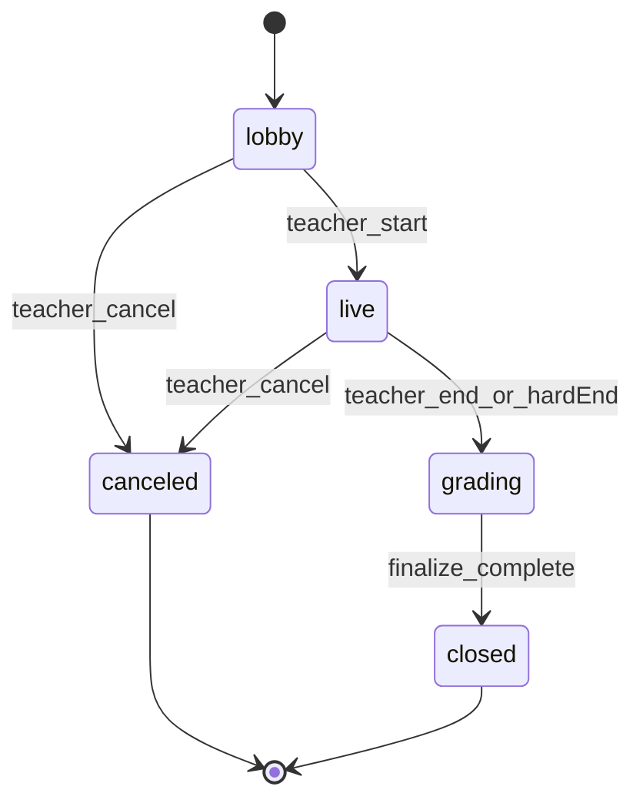

# 05 — Exam Execution & Modes (Sessions, Attempts, Realtime)

## 1) Goals

- Separate **exam definition** (`Exam`) from **execution** (`ExamSession`) and **learner work** (`ExamAttempt`).
- Support **three modes**:
  1. **Real-time** — synchronized start, optional live progress, teacher-controlled end.
  2. **Scheduled** — time window + per-attempt timer rules.
  3. **Self-paced** — deadline-based, flexible start time.

> **Ghi chú (VI)**: Server phải là nguồn sự thật cho `openedAt`, `submittedAt`, và trạng thái session; client chỉ hiển thị.

## 2) Data model

### 2.1 `ExamAssignment` (distribution)

Links an exam template to audience.

| Field | Type | Notes |
|-------|------|------|
| `examId` | ObjectId | |
| `teacherId` | ObjectId | denormalized owner |
| `audience` | enum | `classroom | public_link` |
| `classroomId` | ObjectId? | if audience classroom |
| `mode` | enum | `realtime | scheduled | self_paced` |
| `config` | object | mode-specific (below) |
| `publicJoin` | object? | `{ token, maxUses, expiresAt }` if public |
| `status` | enum | `active | closed` |

**`config` examples**

`self_paced`

```json
{ "dueAt": "2026-05-20T23:59:59.000Z", "timeLimitSeconds": 3600 }
```

`scheduled`

```json
{
  "opensAt": "2026-05-18T08:00:00.000Z",
  "closesAt": "2026-05-18T09:30:00.000Z",
  "timeLimitSeconds": 2700,
  "lateEntryPolicy": "forbidden | allow_until_closes"
}
```

`realtime`

```json
{ "lobbyOpensAt": "...", "scheduledStartAt": "...", "hardEndAt": "..." }
```

### 2.2 `ExamSession` (a run)

Represents one synchronized run (especially realtime; also useful for scheduled cohorts).

| Field | Type | Notes |
|-------|------|------|
| `assignmentId` | ObjectId | |
| `examSnapshot` | object | frozen copy of exam definition + version |
| `status` | enum | see state machine §4 |
| `startedAt` | date? | authoritative |
| `endedAt` | date? | |
| `leaderTeacherId` | ObjectId | |
| `roomCode` | string | short display code for lobby |
| `createdAt` | date | |

### 2.3 `ExamAttempt`

| Field | Type | Notes |
|-------|------|------|
| `sessionId` | ObjectId? | null for pure self-paced without session |
| `assignmentId` | ObjectId | |
| `userId` | ObjectId | student |
| `status` | enum | `in_progress | submitted | expired | void` |
| `startedAt` | date | server timestamp on start |
| `submittedAt` | date? | |
| `answers` | object | map keyed by `itemId` |
| `gradingState` | enum | `pending_auto | pending_ai | pending_manual | finalized` |
| `scores` | object | per-item + totals (see `06`) |
| `integrity` | object | optional telemetry (tab switches count) |

**`answers` shape (examples)**

MCQ:

```json
{ "q1": { "selectedIndexes": [2] } }
```

Fill blank:

```json
{ "q2": { "blanks": { "b1": "go" } } }
```

Essay:

```json
{ "e1": { "text": "..." } }
```

Speaking:

```json
{ "s1": { "audioUrl": "https://..." } }
```

## 3) Execution flows by mode

### 3.1 Self-paced

1. Student opens assignment → `POST /api/exams/assignments/:id/start` creates attempt (`in_progress`) with `startedAt`.
2. Autosave answers: `PATCH /api/exams/attempts/:attemptId` (throttled).
3. Submit: `POST /api/exams/attempts/:attemptId/submit` validates `dueAt` + incomplete rules.
4. Objective grading runs inline or queued; AI/manual follows `06`.

### 3.2 Scheduled window

1. Student can `start` only if `now ∈ [opensAt, closesAt]` per policy.
2. Timer: `deadlineAt = min(startedAt + timeLimitSeconds, closesAt)` (document chosen rule in implementation).
3. Auto-submit when deadline passes (cron/worker or lazy finalize on next read — prefer worker for fairness).

### 3.3 Real-time

1. Teacher creates session for assignment: `POST /api/exams/sessions`.
2. Students join lobby: `POST /api/exams/sessions/:id/join`.
3. Teacher `start` → server sets `startedAt`, transitions session `live`, emits Socket event.
4. Students receive synchronized state; answers patch allowed only while `live`.
5. Teacher `end` or `hardEndAt` triggers finalize + optional auto-close attempts.

> **Ghi chú (VI)**: Real-time mode nên bắt buộc `examSnapshot` để tránh giáo viên sửa đề giữa chừng.

## 4) Session state machine

States (suggested):

- `lobby` → `live` → `grading` → `closed`
- Failure paths: `canceled` (teacher), `aborted` (system)



## 5) Socket.IO design

Extend [`english_for_community_backend/src/socket/socketManager.js`](../../english_for_community_backend/src/socket/socketManager.js):

### 5.1 Rooms

- `examSession_{sessionId}` — all participants (teacher + students)
- Optional: `examSession_{sessionId}_teacher` for control events

### 5.2 Server → client events

| Event | Payload (example) | When |
|-------|-------------------|------|
| `exam_session_state` | `{ sessionId, status, serverNow }` | lobby/live transitions |
| `exam_countdown` | `{ seconds }` | synchronized start |
| `exam_attempt_locked` | `{ attemptId, reason }` | submit/end |
| `exam_leaderboard_update` | `{ top: [...] }` | optional realtime mode (feature flag) |

### 5.3 Client → server events (optional; prefer REST for mutations)

For simplicity v1:

- **Use REST** for authoritative transitions (`start`, `submit`).
- Use Socket for **broadcast notifications** only (teacher triggers start → server emits).

> **Ghi chú (VI)**: Tránh để client emit “submit” qua socket mà không có idempotency; REST + idempotency-Key tốt hơn.

### 5.4 Auth for sockets

- Reuse JWT verification middleware pattern used elsewhere (project has `verifyTokenSocket.js` — wire exam join to authenticated user).

## 6) Public link flow (no classroom)

- `publicJoin.token` maps to assignment with `audience=public_link`.
- `POST /api/exams/public/:token/start` requires login unless product explicitly allows anonymous (default: **require login**).

## 7) Anti-cheat & integrity (pragmatic v1)

- Track `integrity.tabSwitchCount`, `integrity.focusLossSeconds` (client reports; server stores but does not auto-fail by default).
- Disable copy/paste on web (Flutter mobile limited) — optional.
- Randomize items/options per attempt if settings enabled (server generates permutation map stored on attempt).

> **Ghi chú (VI)**: “Chống gian lận” bản v1 là **hạn chế nhẹ + audit**, không hứa proctoring.

## 8) API summary (execution)

| Method | Path | Description |
|--------|------|-------------|
| `POST` | `/api/teacher/exams/assignments` | create assignment |
| `POST` | `/api/exams/assignments/:id/start` | learner start attempt |
| `PATCH` | `/api/exams/attempts/:id` | autosave answers |
| `POST` | `/api/exams/attempts/:id/submit` | submit |
| `POST` | `/api/teacher/exams/sessions` | create realtime session |
| `POST` | `/api/exams/sessions/:id/join` | learner join lobby |
| `POST` | `/api/teacher/exams/sessions/:id/start` | teacher start |
| `POST` | `/api/teacher/exams/sessions/:id/end` | teacher end |

Exact prefix grouping is consolidated in `07-technical-architecture.md`.

## 9) Acceptance criteria

- Each mode has a documented server time rule and corresponding tests (unit).
- Realtime start emits socket event to all lobby members.
- Attempt cannot mutate after `submitted` / `expired`.
