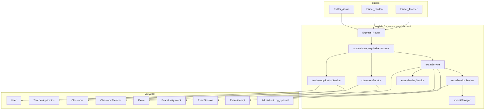

# 07 — Technical Architecture (Teacher Exams)

## 1) System overview

> **Ghi chú (VI)**: Controller mỏng, toàn bộ invariant nằm trong **service** + **zod** validate input.

## 2) Collections (authoritative list)

| Collection | Purpose |
|------------|---------|
| `TeacherApplication` | Workflow self-apply → admin decision |
| `Classroom` | Teacher-owned class space |
| `ClassroomMember` | Student membership rows |
| `Exam` | Mixed exam template |
| `ExamAssignment` | Distribution config + public token |
| `ExamSession` | Realtime/scheduled run + `examSnapshot` |
| `ExamAttempt` | Student responses + grading |

Optional later: `ExamGradingJob` for async AI queue.

## 3) Route map (single consistent prefix)

> Implementation can choose `/api/teacher/...` for authoring and `/api/exams/...` for learner — below lists logical grouping.

### 3.1 Admin — teacher applications

| Method | Path | Middleware |
|--------|------|------------|
| `GET` | `/api/admin/teacher-applications` | `authenticate`, `requireAdmin` |
| `POST` | `/api/admin/teacher-applications/:id/approve` | same |
| `POST` | `/api/admin/teacher-applications/:id/reject` | same |

### 3.2 User/Teacher — application

| Method | Path | Middleware |
|--------|------|------------|
| `POST` | `/api/teacher/applications` | `authenticate` |
| `GET` | `/api/teacher/applications/me` | `authenticate` |
| `POST` | `/api/teacher/applications/withdraw` | `authenticate` |

### 3.3 Classrooms

| Method | Path | Middleware |
|--------|------|------------|
| `POST` | `/api/classrooms` | `authenticate`, `requirePermissions(['teacher.classroom.manage'])` |
| `GET` | `/api/classrooms/mine` | teacher permission |
| `GET` | `/api/classrooms/:id` | `authenticate` + member-or-owner |
| `PATCH` | `/api/classrooms/:id` | owner |
| `POST` | `/api/classrooms/join-by-code` | `authenticate` |
| `POST` | `/api/classrooms/join-by-token` | `authenticate` |

### 3.4 Exams (authoring)

| Method | Path | Middleware |
|--------|------|------------|
| `POST` | `/api/teacher/exams` | `teacher.exam.manage` |
| `GET` | `/api/teacher/exams` | `teacher.exam.manage` |
| `GET` | `/api/teacher/exams/:examId` | owner |
| `PATCH` | `/api/teacher/exams/:examId` | owner |
| `POST` | `/api/teacher/exams/:examId/publish` | owner |

### 3.5 Assignments & sessions

| Method | Path | Middleware |
|--------|------|------------|
| `POST` | `/api/teacher/exams/assignments` | `teacher.exam.assign` |
| `POST` | `/api/teacher/exams/sessions` | `teacher.exam.session.run` |
| `POST` | `/api/teacher/exams/sessions/:sessionId/start` | `teacher.exam.session.run` |
| `POST` | `/api/teacher/exams/sessions/:sessionId/end` | `teacher.exam.session.run` |

### 3.6 Learner exam runtime

| Method | Path | Middleware |
|--------|------|------------|
| `GET` | `/api/exams/assignments/available` | `authenticate` |
| `POST` | `/api/exams/assignments/:assignmentId/start` | `authenticate` + entitlements |
| `PATCH` | `/api/exams/attempts/:attemptId` | `authenticate` + attempt owner |
| `POST` | `/api/exams/attempts/:attemptId/submit` | `authenticate` + attempt owner |
| `POST` | `/api/exams/sessions/:sessionId/join` | `authenticate` |

### 3.7 Grading

| Method | Path | Middleware |
|--------|------|------------|
| `GET` | `/api/teacher/exams/grading-queue` | `teacher.grading.read` |
| `PATCH` | `/api/teacher/exams/attempts/:attemptId/items/:itemId` | `teacher.grading.write` |
| `POST` | `/api/teacher/exams/attempts/:attemptId/release` | `teacher.grading.write` |

## 4) Ownership & entitlements (service-layer)

Implement pure functions / service methods:

- `assertTeacherOwnsExam(teacherId, examId)`
- `assertStudentEntitledToAssignment(userId, assignmentId)`  
  - classroom membership OR valid public token flow
- `assertAttemptOwner(userId, attemptId)`

> **Ghi chú (VI)**: Không truyền `teacherId` từ client; lấy từ JWT user.

## 5) Socket.IO

Extend [`english_for_community_backend/src/socket/socketManager.js`](../../english_for_community_backend/src/socket/socketManager.js):

- `join_exam_session` with `{ sessionId }` → join `examSession_{sessionId}`
- Server emits `exam_session_state` on transitions triggered by REST controllers/services.

Authenticate socket connections using [`english_for_community_backend/src/middleware/verifyTokenSocket.js`](../../english_for_community_backend/src/middleware/verifyTokenSocket.js) (already in project layout).

## 6) Integration with existing E4C modules

| Module | Integration |
|--------|-------------|
| **Gamification** | Optional: award small XP on exam completion — feature-flagged. |
| **Progress** | Optional: write summary stats into progress service. |
| **Notifications** | FCM: assignment published, grading released, session starting soon. |
| **AI** | Reuse provider stack; add exam-specific prompts in `examGradingService`. |

## 7) Indexing & performance

- `ExamAttempt`: `{ assignmentId: 1, userId: 1, status: 1 }`
- `ExamAssignment`: `{ teacherId: 1, status: 1, updatedAt: -1 }`
- `ExamSession`: `{ assignmentId: 1, status: 1 }`

## 8) Scalability notes

- Realtime broadcasts should avoid sending full attempt documents; send compact state.
- For many concurrent sessions, prefer **horizontal scaling** with Socket.IO Redis adapter (future); document as Phase 6+ infra.

## 9) Flutter architecture touchpoints

- New datasources + repositories + BLoCs under `feature/teacher/` and `feature/exams/` (names TBD) registered in [`english_for_community/lib/core/get_it/get_it.dart`](../../english_for_community/lib/core/get_it/get_it.dart).
- Router updates in [`english_for_community/lib/core/router/app_router.dart`](../../english_for_community/lib/core/router/app_router.dart).

## 10) Backward compatibility

- Default users unchanged.
- All new routes are additive.
- `User.role` enum extension requires migration script for any validators that assume only two roles.

## 11) Acceptance criteria

- Route table matches implemented modules (update this doc if paths change).
- Ownership rules documented here are enforced in code review checklist.
