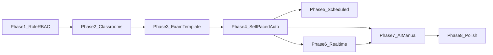

# 09 — Implementation Roadmap (Phased)

## 0) Preconditions

- Read `01`–`08` in the order listed in [`README.md`](README.md).
- Confirm product decisions locked:
  - teacher self-apply + admin approve
  - three exam modes
  - mixed item types
  - grading: auto + AI + manual

> **Ghi chú (VI)**: Mỗi phase phải có migration script + test tối thiểu cho service chính.

## Phase 1 — Teacher role + RBAC + applications

**Backend**

- Extend `User.role` enum with `teacher`.
- Add `TeacherApplication` model + service + zod validation.
- Routes: user apply + admin review (`07` table).
- Update [`permissions.js`](../../english_for_community_backend/src/constants/permissions.js) + [`auth.js`](../../english_for_community_backend/src/middleware/auth.js) usage on routes.
- Block any user-controlled role updates in profile endpoints (audit).

**Flutter**

- `UserEntity` supports `teacher` string.
- Router guard for `/teacher/*`.
- Applicant UI + admin review UI (minimal).

**Exit criteria**

- A user can apply, admin approves, JWT reflects `role=teacher`, teacher routes accessible.

## Phase 2 — Classroom system

**Backend**

- Models: `Classroom`, `ClassroomMember`.
- Join by code/token; rotate token; archive.
- Ownership checks in services.

**Flutter**

- Teacher classroom CRUD + student join flow.

**Exit criteria**

- Teacher creates class, student joins, both see class detail.

## Phase 3 — Exam builder (template only)

**Backend**

- `Exam` model with polymorphic items + publish validation.
- CRUD endpoints under `/api/teacher/exams`.

**Flutter**

- Exam builder wizard (draft + publish).

**Exit criteria**

- Published mixed exam validates server-side; cannot publish incomplete exam.

## Phase 4 — Assignments + self-paced execution + auto grading

**Backend**

- `ExamAssignment` with `mode=self_paced`.
- `ExamAttempt` lifecycle: start/autosave/submit.
- Auto score objective items; write `gradingState`.

**Flutter**

- Student assignment list + exam runner + submit.

**Exit criteria**

- End-to-end: assign to class → student completes → objective score visible per policy.

## Phase 5 — Scheduled mode

**Backend**

- Window validation + deadline merge rules.
- Auto-expire worker (or safe lazy finalize documented).

**Flutter**

- Scheduled UI hints + disabled start outside window.

**Exit criteria**

- Cannot start before `opensAt` or after `closesAt` (per policy).

## Phase 6 — Realtime mode + Socket.IO

**Backend**

- `ExamSession` + lobby/live transitions.
- Socket room join + broadcast helper used by session service.
- Snapshot binding `examSnapshot` on session creation.

**Flutter**

- Teacher session console + student lobby/live UX.

**Exit criteria**

- Teacher start event reaches all lobby clients within acceptable latency on dev/staging.

## Phase 7 — AI grading + manual finalize/release

**Backend**

- `examGradingService` integrates AI provider; stores model metadata.
- Manual override endpoints + release.

**Flutter**

- Grading queue + attempt detail editor.

**Exit criteria**

- Mixed exam with essay: AI draft → teacher adjusts → student sees released score.

## Phase 8 — Analytics, hardening, polish

- Abuse controls: rate limits, public link caps, reporting.
- Metrics dashboards (minimal), logging correlation ids.
- Performance testing for concurrent sessions.

**Exit criteria**

- Pilot checklist in `10-ai-implementation-prompts.md` passes.

## Dependency graph

## Risk register (short)

| Risk | Mitigation |
|------|------------|
| Socket scale | Start single-node; document Redis adapter upgrade path |
| AI cost spikes | quotas + batch + teacher-triggered regrade only |
| Cheating claims | integrity telemetry + disclaimers |
