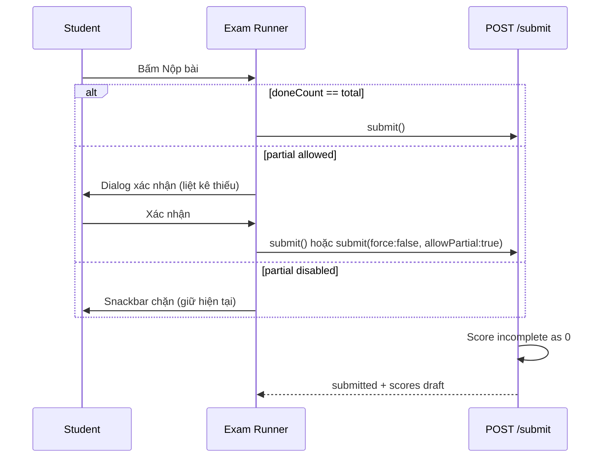

# 13 — Nộp bài chưa hoàn thành (Partial Submit) & Trung tâm chấm bài (Grading Hub)

> **Mục tiêu**: Học sinh có thể **nộp bài khi chưa làm hết** (có xác nhận); giáo viên thấy **danh sách bài làm theo assignment** để chấm tay hoặc dùng AI, rồi công bố điểm.
>
> **Trạng thái code (2026-05)**: Backend + Flutter đã có nền tảng (`submit`, `TeacherExamGradingPage`, `TeacherExamAttemptGradePage`, `examGradingService.runAiSuggestions`) nhưng **chưa bật partial submit** và UI chấm bài còn tối giản.

---

## 1) Vấn đề hiện tại

### 1.1 Học sinh không nộp được khi chưa làm xong

| Lớp | Hành vi hiện tại | File tham chiếu |
|-----|------------------|-----------------|
| **Integrated / Skills exam** | Nút **Nộp bài** chỉ `enabled` khi `doneCount == total` (mọi phần kỹ năng đã `completed` + mọi câu Grammar đã trả lời). Client chặn trước khi gọi API. | `integrated_exam_runner_page.dart` (`_submit`, nút FilledButton) |
| **Integrated / Skills exam** | API `POST .../submit` ném `400` nếu thiếu Grammar hoặc skill chưa `completed: true` (trừ `forceEnd` khi GV kết thúc phiên). | `examAttemptService.js` |
| **Classic exam** | Nút nộp thường luôn bật; backend chấp nhận thiếu câu (câu trống = 0 điểm). Essay/speaking → `pending_manual`. | `exam_runner_page.dart`, `examAttemptService.js` |

**Kết luận**: Với đề **4 kỹ năng + Grammar** (format phổ biến trong project), học sinh **bắt buộc hoàn thành 100%** mới nộp được — đây là nguyên nhân chính user báo “không tự nộp bài được”.

### 1.2 Giáo viên — danh sách bài làm

| Đã có | Thiếu / yếu |
|-------|-------------|
| `GET /api/teacher/exams/assignments/:assignmentId/attempts` | Header trang không hiện **tên đề / lớp** |
| `TeacherExamGradingPage` — ListTile email + `status · gradingState` | Lọc theo trạng thái, điểm tóm tắt, thời gian nộp, cờ “nộp chưa đủ” |
| Nút AI từng bài (`runAiGradingDraft`) — essay qua Groq | Speaking chưa AI; không **chấm AI hàng loạt** |
| `TeacherExamAttemptGradePage` — sửa điểm + ghi chú từng item | Rubric AI preview; soạn thảo essay/speaking đầy đủ |
| `releaseExamResults` | Chính sách release gắn assignment/exam settings chưa thống nhất trên UI |

---

## 2) Phạm vi sản phẩm (Product scope)

### 2.1 Trong phạm vi (MVP của epic này)

1. **Partial submit** cho mọi assignment (mặc định **bật** hoặc cấu hình per-assignment — xem §4).
2. Học sinh: dialog xác nhận khi nộp thiếu; hiển thị tiến độ “đã làm X/Y”.
3. Backend: chấp nhận nộp thiếu; chấm phần đã làm; phần chưa làm = **0 điểm**; gắn cờ `meta.submitCompleteness`.
4. Giáo viên: **Grading Hub** theo assignment — danh sách học sinh, lọc, vào chi tiết, **Chấm AI** (1 hoặc nhiều), **Chấm tay**, **Công bố điểm**.
5. Liên kết rõ từ: thẻ bài giao (lớp / dashboard) → Grading Hub.

### 2.2 Ngoài phạm vi (phase sau)

- Xuất CSV gradebook toàn trường.
- AI chấm speaking (STT + rubric) — chỉ essay trong MVP AI.
- Tự động nộp khi hết giờ **không** cần học sinh bấm (auto-submit on timer) — có thể làm song song nhưng tách task.
- Học sinh sửa bài sau khi nộp (reopen attempt).

---

## 3) Nghiệp vụ — Nộp bài chưa hoàn thành (Partial Submit)

### 3.1 Định nghĩa

| Thuật ngữ | Ý nghĩa |
|-----------|---------|
| **Nộp đủ (complete submit)** | Mọi phần bắt buộc theo cấu trúc đề đã đáp ứng điều kiện hoàn thành (như logic hiện tại). |
| **Nộp thiếu (partial submit)** | Học sinh chủ động nộp khi còn phần chưa làm / chưa đánh dấu hoàn thành; hệ thống vẫn ghi nhận `submitted`. |
| **Nộp cưỡng bức (force submit)** | Giáo viên kết thúc phiên live → backend `submit(..., { forceEnd: true })` cho mọi attempt đang làm — **giữ nguyên** như hiện tại. |

### 3.2 Quy tắc nghiệp vụ

| ID | Quy tắc |
|----|---------|
| PS-01 | Khi `allowPartialSubmit !== false` (mặc định **true** cho assignment mới), học sinh **được** bấm Nộp bài dù `doneCount < total`. |
| PS-02 | Trước khi nộp thiếu, hiển thị **dialog xác nhận**: liệt kê phần chưa xong (Grammar câu X, Listening chưa hoàn thành, …). |
| PS-03 | Sau nộp thiếu, attempt `status = submitted`; **không** cho sửa đáp án (trừ policy reopen — ngoài scope). |
| PS-04 | Điểm: phần chưa hoàn thành → **0** trong pool tương ứng; Grammar câu trống → 0; không phạt thêm ngoài việc mất điểm phần đó. |
| PS-05 | Lưu `meta.submitCompleteness = 'complete' \| 'partial' \| 'force_end'` để GV nhìn trên danh sách chấm. |
| PS-06 | Khi `allowPartialSubmit === false` (đề thi “nghiêm”), giữ hành vi cũ: chặn client + API 400. |
| PS-07 | Phiên live **đã closed**: học sinh không nộp thêm (đã xử lý `session_ended`); chỉ xem bài đã nộp nếu có. |
| PS-08 | Hết `attemptDeadlineAt` / quá `dueAt` (self-paced): vẫn **không** cho nộp thường (trừ force GV) — partial không bỏ qua deadline. |

### 3.3 Cấu hình (Config)

Đề xuất lưu trên **`ExamAssignment.config`** (override `Exam.settings`):

```json
{
  "allowPartialSubmit": true,
  "partialSubmitConfirm": true,
  "showResultsPolicy": "after_release"
}
```

| Field | Mặc định | Ghi chú |
|-------|----------|---------|
| `allowPartialSubmit` | `true` | `false` = thi nghiêm (logic cũ) |
| `partialSubmitConfirm` | `true` | Bắt dialog khi nộp thiếu |

Wizard giao bài (`TeacherAssignmentWizardPage`): thêm toggle **“Cho phép nộp khi chưa làm hết”**.

### 3.4 Luồng học sinh (User flow)



### 3.5 Chấm điểm khi nộp thiếu (Integrated / Skills)

Giữ công thức pool hiện tại (`examAttemptService.submit` integrated branch):

| Thành phần | Điều kiện nhận điểm | Khi partial |
|------------|---------------------|-------------|
| Skill section `sid` | `answers[sid].completed === true` | `false` → `awardedPoints = 0`, `completed: false` |
| Grammar `itemId` | `grammarAnswerComplete(item, ans)` | không đủ → `awardedPoints = 0` |
| Tổng | `totalMax` vẫn 100 (hoặc grammar-only) | `totalAwarded` phản ánh phần đã làm |

**Không** ném `400` khi `allowPartialSubmit` và không phải `forceEnd`.

Classic: giữ nguyên — câu trống MCQ/fill = 0; essay trống → `pending_manual` với 0 điểm tạm.

---

## 4) Nghiệp vụ — Trung tâm chấm bài (Grading Hub)

### 4.1 Màn hình chính: Danh sách bài làm theo assignment

**Route Flutter (đã có)**: `/teacher/exam-grading/:assignmentId` → `TeacherExamGradingPage`

**Cải tiến bắt buộc (MVP UI)**:

| Cột / thông tin | Nguồn dữ liệu |
|-----------------|---------------|
| Học sinh (tên + email) | `userId` populated |
| Trạng thái attempt | `status`: in_progress / submitted / expired |
| Trạng thái chấm | `gradingState`: pending_auto / pending_ai / pending_manual / finalized |
| Điểm tóm tắt | `scores.totalAwarded` / `scores.totalMax` (nếu submitted) |
| Thời gian nộp | `submittedAt` |
| Cờ nộp thiếu | `meta.submitCompleteness === 'partial'` |
| Hành động | **Chấm** (mở chi tiết), **AI**, **Công bố** (nếu finalized & chưa release) |

**Bộ lọc (chips)**:

- Tất cả | Đang làm | Đã nộp | Cần chấm tay | Đã chấm xong | Đã công bố | Nộp thiếu

**Header trang**:

- Tiêu đề đề thi (`examSummary.title` hoặc populate `examId`)
- Lớp (nếu `audience === classroom`)
- Thống kê: `N đã nộp / M thành viên` (optional phase 1.1 — cần API đếm member)

### 4.2 Màn hình chi tiết: Chấm từng bài làm

**Route (đã có)**: `/teacher/exam-grading/:assignmentId/attempt/:attemptId` → `TeacherExamAttemptGradePage`

**MVP bổ sung**:

- Banner trạng thái: partial / force_end / complete.
- Tab hoặc section: **Tự động (MCQ/Grammar)** | **Cần chấm (Essay)** | **Kỹ năng (Listening/Reading/Speaking/Writing)**.
- Nút **“Gợi ý AI”** → gọi `POST .../grading/ai` (đã có) → hiển thị điểm + rationale; GV chỉnh tay rồi **Lưu**.
- Nút **“Hoàn tất chấm”** → `finalize` (nếu chưa có endpoint, thêm `POST .../attempts/:id/finalize`).
- Nút **“Công bố cho học sinh”** → `release` (đã có).

### 4.3 Chấm AI

| ID | Quy tắc |
|----|---------|
| AI-01 | Chỉ chạy trên attempt `status === submitted`. |
| AI-02 | MVP: **essay** qua Groq (`examGradingService.runAiSuggestions`) — ghi `scores.items[itemId].breakdown.ai`. |
| AI-03 | Sau AI, `gradingState` có thể là `pending_manual` (GV duyệt) hoặc `finalized` nếu policy auto-approve AI. |
| AI-04 | Hub: nút **“Chấm AI tất cả đã nộp”** (batch) — gọi tuần tự hoặc queue; hiện progress. |
| AI-05 | Lỗi AI → item `pending_manual`, thông báo trên dòng học sinh. |

### 4.4 Chấm tay

| ID | Quy tắc |
|----|---------|
| MG-01 | GV sửa `awardedPoints` trong `[0, maxPoints]` từng item (đã có PATCH pattern trong grade page). |
| MG-02 | Ghi chú feedback lưu vào `scores.items[itemId].breakdown.manual.note`. |
| MG-03 | Tổng điểm recalculate server-side sau PATCH (không tin client tổng). |
| MG-04 | Speaking/Writing skill parts: MVP cho phép nhập điểm thủ công theo `perSkill` pool (section-level), không bắt buộc mở CMS skill attempt. |

### 4.5 Công bố điểm (Release)

| `showResultsPolicy` (exam/assignment) | Hành vi |
|-------------------------------------|---------|
| `never` | Release chỉ đổi `resultsReleased` nhưng student UI vẫn ẩn điểm chi tiết |
| `after_submit` | Auto release phần auto; essay chờ release |
| `after_release` | Student chỉ thấy điểm sau khi GV bấm Công bố |

Hub hiển thị badge **“Chưa công bố”** khi `finalized && !resultsReleased`.

### 4.6 Điểm vào Grading Hub (Navigation)

| Từ | Hành động |
|----|-----------|
| Thẻ bài giao — lớp GV (`teacher_classroom_detail_page`) | Nút **“Chấm bài”** → Grading Hub |
| Dashboard — hub assignment card | **“Chấm”** (đã có) |
| Lịch sử phiên đã kết thúc | **“Chấm bài”** (đã có) |
| Console phiên live (kết thúc phiên) | Snackbar + link **“Xem bài đã nộp”** → Hub |

---

## 5) Thiết kế kỹ thuật

### 5.1 Backend — Thay đổi `examAttemptService.submit`

```javascript
// Pseudocode
const assignment = await ExamAssignment.findById(attempt.assignmentId);
const allowPartial =
  assignment?.config?.allowPartialSubmit ??
  exam.settings?.allowPartialSubmit ??
  true;

if (!forceEnd && integratedFormat) {
  if (!allowPartial) {
    // existing validation (grammar complete + all sections completed)
  } else {
    // skip validation throws; still score with completed flags
    attempt.meta = {
      ...attempt.meta,
      submitCompleteness: allPartsDone ? 'complete' : 'partial',
    };
  }
}
```

**API student** — không đổi path; optional body:

```http
POST /api/exams/attempts/:attemptId/submit
{ "acknowledgePartial": true }
```

Server có thể bỏ qua field nếu `allowPartialSubmit` đã bật.

### 5.2 Backend — Enrich danh sách attempts cho GV

Mở rộng response `listAssignmentAttempts`:

```json
{
  "id": "...",
  "status": "submitted",
  "gradingState": "pending_manual",
  "submittedAt": "...",
  "resultsReleased": false,
  "meta": { "submitCompleteness": "partial" },
  "scores": { "totalAwarded": 42, "totalMax": 100 },
  "userId": { "fullName": "...", "email": "..." },
  "summary": {
    "pendingManualCount": 2,
    "grammarAwarded": 20,
    "grammarMax": 30
  }
}
```

Optional endpoint (phase 1.1):

```http
GET /api/teacher/exams/assignments/:assignmentId/grading-summary
```

### 5.3 Backend — API grading (hiện có + đề xuất)

| Method | Path | Trạng thái |
|--------|------|------------|
| `GET` | `/api/teacher/exams/assignments/:assignmentId/attempts` | Có — enrich |
| `GET` | `/api/teacher/exams/attempts/:attemptId/grading` | Có (`getGradingAttempt`) |
| `PATCH` | `/api/teacher/exams/attempts/:attemptId/items/:itemId` | Kiểm tra / hoàn thiện |
| `POST` | `/api/teacher/exams/attempts/:attemptId/grading/ai` | Có |
| `POST` | `/api/teacher/exams/attempts/:attemptId/release` | Có |
| `POST` | `/api/teacher/exams/attempts/:attemptId/finalize` | **Thêm** nếu chưa có |
| `POST` | `/api/teacher/exams/assignments/:assignmentId/grading/ai-batch` | **Thêm** (optional MVP) |

### 5.4 Flutter — Học sinh

| File | Thay đổi |
|------|----------|
| `integrated_exam_runner_page.dart` | Nút Nộp: `onPressed` khi `allowPartialSubmit` hoặc `doneCount == total`; dialog xác nhận |
| `exam_runner_page.dart` | Dialog tương tự nếu có checklist câu hỏi bắt buộc (classic ít cần) |
| `exam_assignment_card.dart` / runtime | Đọc `allowPartialSubmit` từ `runtimeContext` hoặc assignment snapshot trên attempt |
| `app_en.arb` / `app_vi.arb` | Chuỗi dialog partial submit |

**Đọc config**: `attempt.runtimeContext.assignmentConfig.allowPartialSubmit` — backend `attachRuntimeContextToAttempt` cần trả field này.

### 5.5 Flutter — Giáo viên

| File | Thay đổi |
|------|----------|
| `teacher_exam_grading_page.dart` | Header assignment; filter chips; card đẹp hơn; empty state đúng |
| `teacher_exam_attempt_grade_page.dart` | Banner partial; nhóm item theo loại; polish AI result |
| `teacher_assignment_wizard_page.dart` | Toggle allowPartialSubmit |
| `teacher_classroom_detail_page.dart` | Đảm bảo nút Chấm → hub |

---

## 6) Kế hoạch triển khai (Phases)

### Phase A — Partial submit (ưu tiên cao, ~2–3 ngày)

| # | Task | Layer |
|---|------|-------|
| A1 | `allowPartialSubmit` trên `ExamAssignment.config` + default true | BE model/assign |
| A2 | Sửa `submit()` bỏ validation khi allow partial; set `meta.submitCompleteness` | BE |
| A3 | Trả `allowPartialSubmit` trong `runtimeContext` | BE |
| A4 | Integrated runner: nút nộp + dialog | Flutter |
| A5 | l10n EN/VI | Flutter |
| A6 | QA: nộp 2/4 skill → điểm ~50% pool; nộp thiếu grammar → 0 câu trống | QA |

**Acceptance A**:

- [ ] HS nộp được khi mới làm 1 phần Grammar + 1 skill.
- [ ] HS với `allowPartialSubmit: false` vẫn bị chặn như cũ.
- [ ] GV thấy cờ partial trên attempt (API field).

### Phase B — Grading Hub MVP (~3–4 ngày)

| # | Task | Layer |
|---|------|-------|
| B1 | Enrich `listAssignmentAttempts` (scores, meta, user display) | BE |
| B2 | Redesign `TeacherExamGradingPage` (header, filters, cards) | Flutter |
| B3 | Sửa empty state / copy | Flutter |
| B4 | Link từ classroom + session console | Flutter |
| B5 | `finalize` endpoint nếu thiếu | BE |

**Acceptance B**:

- [ ] GV mở từ lớp → thấy danh sách HS đã nộp / đang làm.
- [ ] Lọc “Cần chấm tay” hoạt động.
- [ ] Tap vào HS → màn chấm chi tiết.

### Phase C — AI & Release polish (~2 ngày)

| # | Task | Layer |
|---|------|-------|
| C1 | Hiển thị kết quả AI trên grade page | Flutter |
| C2 | Batch AI (optional) | BE + Flutter |
| C3 | Release policy UI + trạng thái student | Flutter |

### Phase D — Wizard & policy (~1 ngày)

| # | Task |
|---|------|
| D1 | Toggle partial submit khi giao bài |
| D2 | Docs cập nhật `12-teacher-feature-catalog` |

---

## 7) Tiêu chí chấp nhận tổng (Epic)

1. **Học sinh** có thể nộp bài integrated khi chưa hoàn thành tất cả phần (mặc định được phép).
2. **Điểm** phản ánh đúng phần đã làm; phần chưa làm = 0.
3. **Giáo viên** xem được danh sách bài làm của một assignment với đủ thông tin để quyết định chấm.
4. **Giáo viên** chấm tay từng item / section và/hoặc chạy AI essay.
5. **Giáo viên** công bố điểm; học sinh thấy kết quả theo policy.
6. Không regression: kết thúc phiên live vẫn force-submit attempts đang làm.

---

## 8) Rủi ro & giảm thiểu

| Rủi ro | Giảm thiểu |
|--------|------------|
| HS nộp nhầm sớm | Dialog xác nhận + hiển thị % hoàn thành |
| GV không biết ai nộp thiếu | Badge `partial` trên hub |
| AI cho điểm sai | Luôn `pending_manual` hoặc bắt GV bấm Approve |
| Batch AI timeout | Giới hạn concurrency; retry per attempt |

---

## 9) Map tới code hiện tại

| Thành phần | Đường dẫn |
|------------|-----------|
| Submit logic | `english_for_community_backend/src/services/examAttemptService.js` |
| AI grading | `english_for_community_backend/src/services/examGradingService.js` |
| GV list attempts | `teacherExamController.listAssignmentAttempts` |
| Student integrated UI | `lib/feature/student/exams/integrated_exam_runner_page.dart` |
| GV grading list | `lib/feature/teacher/teacher_exam_grading_page.dart` |
| GV grade detail | `lib/feature/teacher/teacher_exam_attempt_grade_page.dart` |

---

## 10) Prompt triển khai nhanh (cho AI codegen)

> Implement **Phase A** first: backend `allowPartialSubmit` + `submitCompleteness` + Flutter integrated runner partial submit dialog. Then **Phase B**: enrich `listAssignmentAttempts` and redesign `TeacherExamGradingPage` per section 4. Follow `project.mdc` (BLoC, ARB en+vi, Either). Do not break `forceEnd` on session close.

---

## 11) Tài liệu liên quan

- [06-grading-system-design.md](06-grading-system-design.md)
- [05-exam-execution-and-modes.md](05-exam-execution-and-modes.md)
- [12-teacher-feature-catalog-and-dashboard-spec.md](12-teacher-feature-catalog-and-dashboard-spec.md) — backlog partial submit
